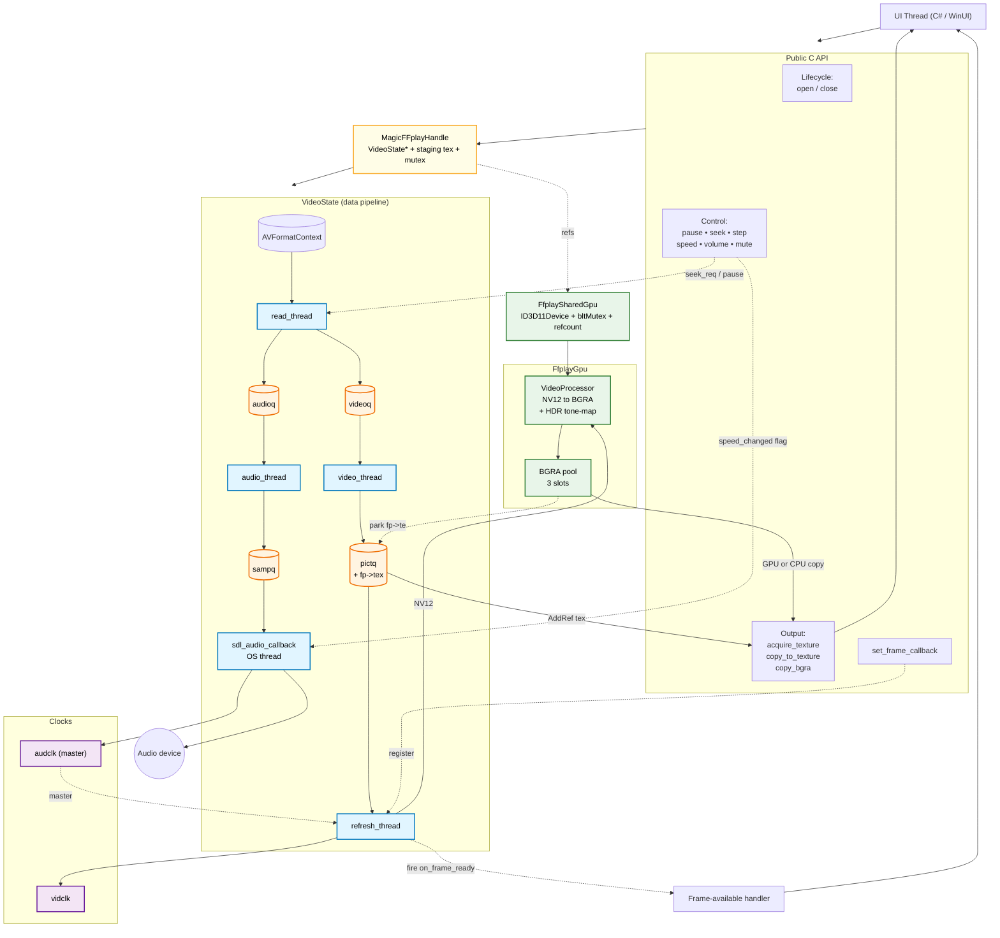
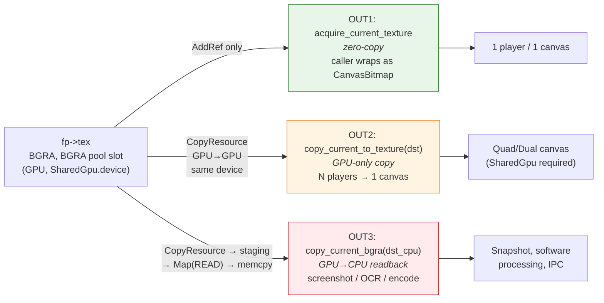
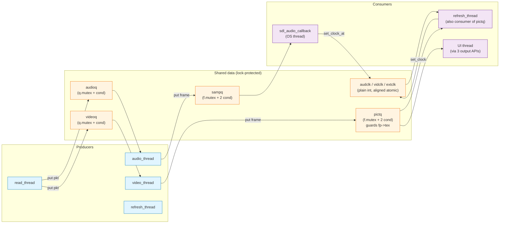

# MagicFFplay — Overview Architecture

Sơ đồ tổng quan toàn bộ kiến trúc `MagicFFplay.cpp`. Tham chiếu chi tiết: [MagicFFplay.md](./MagicFFplay.md).

## 1. Component & data-flow overview

Layout 3 tầng từ trên xuống: **Caller / API** → **Bridge (Handle + SharedGpu)** → **Runtime**. Data pipeline trong VideoState đi một chiều trái sang phải. GPU và Clocks tách ra hai khối nhỏ bên cạnh để không cắt qua pipeline.

**Cách đọc**:
- Đi từ trên xuống thấy **chuỗi sở hữu**: UI → API → Handle → VideoState.
- Đi từ trái sang phải trong `RUNTIME` thấy **luồng dữ liệu**: file → demuxer → packet queue → decoder → frame queue → consumer (refresh / SDL).
- GPU và Clocks là **dịch vụ phụ trợ** ở dưới, nối vào pipeline qua mũi tên ngắn.
- Đường nét đứt = control / side-channel (callback, flag, refcount). Đường nét liền = data flow chính.

## 2. Three output paths (cheat sheet)

## 3. Thread / queue / clock matrix

## 4. Cross-references

| Sơ đồ | Mục chi tiết trong MagicFFplay.md |
|---|---|
| Component & data-flow | §1 Tổng quan, §2.1 Mở file, §2.7 Video refresh, §2.8 UI consumer |
| Three output paths | §2.8 (bảng API + cost) |
| Thread / queue / clock matrix | §4 Threading model |
| Speed control box | §2.6 Audio filter chain, §2.10 Đổi speed |
| GPU subgraph (FfplayGpu / SharedGpu) | §1 Hai chế độ GPU, §3 Texture pool BGRA |
| Handle + staging | §6 Lifetime mô hình + struct `MagicFFplayHandle` |
