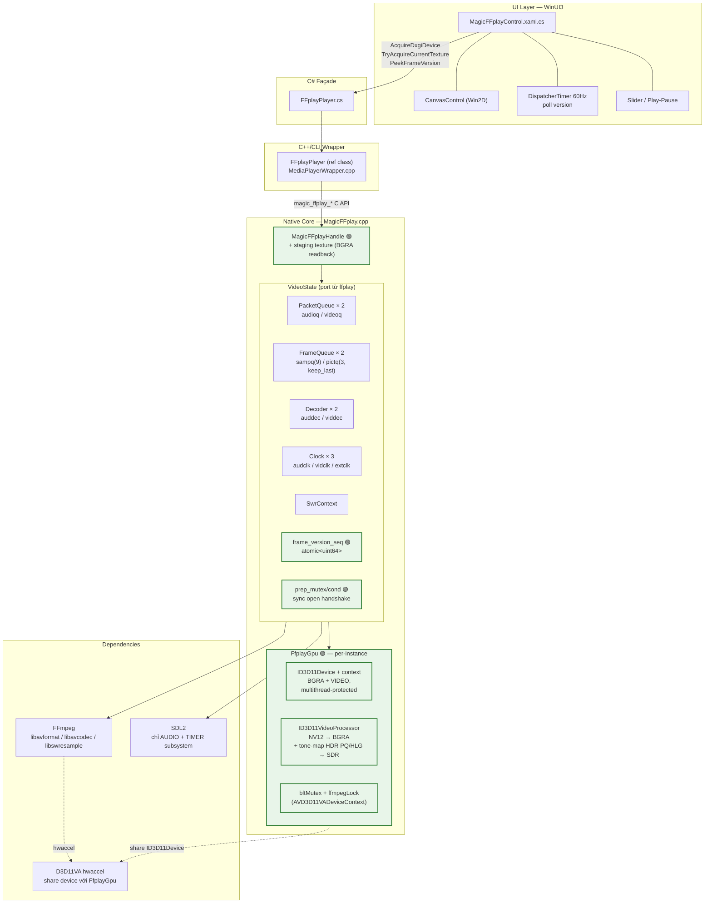
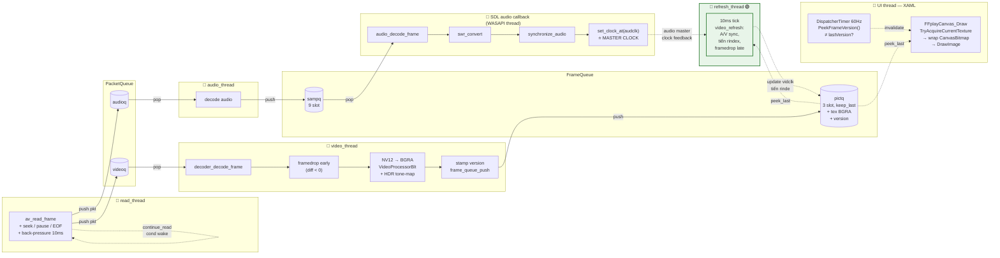
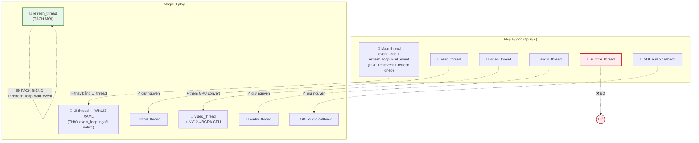
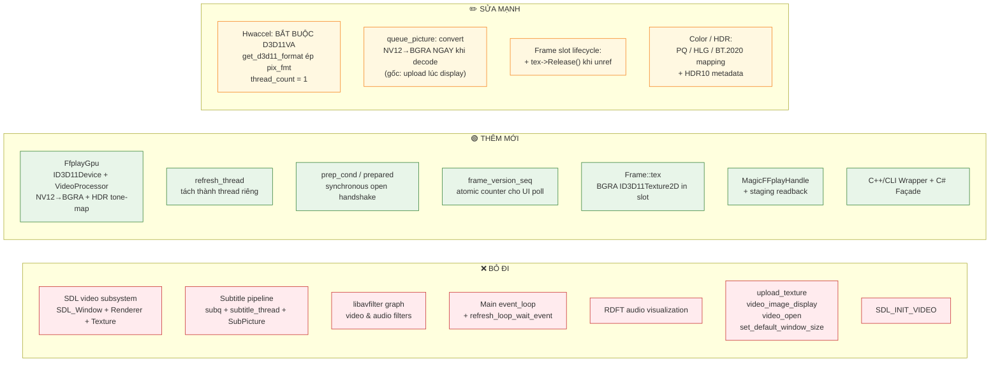

# MagicFFplay — Sơ đồ tổng quan

> Tài liệu chi tiết: [MagicFFplay.md](MagicFFplay.md).
> File này tóm tắt các **component chính**, **thread chính**, và **khác biệt
> so với `ffplay.c` upstream** ở mức bản đồ tổng quan để hiểu nhanh cách
> MagicFFplay hoạt động.

---

## 1. Sơ đồ component

> 🟢 = component **không có trong ffplay gốc**, được thêm cho MagicFFplay.

Cùng `ID3D11Device` đi xuyên suốt: decoder D3D11VA → VideoProcessor →
`CanvasDevice` của Win2D. BGRA texture từ GPU đi thẳng sang `CanvasBitmap`
qua `IDXGISurface`, **zero-copy**, không qua CPU.

---

## 2. Sơ đồ thread & luồng data

### Tổng số thread native do MagicFFplay quản lý

| # | Thread | Tạo bởi | Vai trò |
|---|---|---|---|
| 1 | `read_thread` | `SDL_CreateThread` trong `stream_open` | Demux: `av_read_frame` → `PacketQueue`. Phục vụ seek, pause/resume, back-pressure. |
| 2 | `video_thread` | `SDL_CreateThread` trong `stream_component_open` | Decode video → framedrop early → NV12→BGRA `VideoProcessorBlt` → push `pictq` + stamp version. |
| 3 | `audio_thread` | `SDL_CreateThread` trong `stream_component_open` | Decode audio → push `sampq`. |
| 4 | `refresh_thread` 🟢 | `SDL_CreateThread` trong `stream_open` | A/V sync chuyên dụng: 10ms tick, `video_refresh` tiến `pictq.rindex` theo PTS deadline, framedrop late. |
| 5 | SDL audio callback | SDL audio backend (Windows: WASAPI thread) | Pull sample từ `sampq`, mix theo volume, **set audio master clock**. |

UI thread (XAML) tách hoàn toàn khỏi native, chỉ poll `frame_version_seq`
qua C API.

---

## 3. Khác biệt so với FFplay gốc (`ffplay.c` upstream)

### 3.1 Đối chiếu thread side-by-side

**Tổng kết thread**: MagicFFplay **bớt 1 thread** (subtitle), **tách 1 thread
mới** (`refresh_thread`), **bỏ main event loop native** (UI XAML thay thế).

### 3.2 Component diff

### 3.3 Pipeline data video — so sánh

```mermaid
flowchart TB
    subgraph FFPipe["FFplay gốc — path video"]
        FP1["AVPacket"]
        FP2["decoder (sw / hw)"]
        FP3["AVFrame (YUV)"]
        FP4["libavfilter graph<br/>scale / format / eq"]
        FP5["AVFrame (YUV/RGB)"]
        FP6["pictq slot (AVFrame only)"]
        FP7["upload_texture<br/>⚠️ CPU memcpy / GPU upload"]
        FP8["SDL_RenderCopy<br/>SDL_RenderPresent"]
        FP1 --> FP2 --> FP3 --> FP4 --> FP5 --> FP6 --> FP7 --> FP8
    end

    subgraph MGPipe["MagicFFplay — path video"]
        MP1["AVPacket"]
        MP2["decoder D3D11VA"]
        MP3["AVFrame NV12 trên<br/>ID3D11Texture2D + slice idx"]
        MP4["video_thread:<br/>ffplay_gpu_nv12_to_bgra<br/>VideoProcessorBlt GPU<br/>+ HDR tone-map"]
        MP5["BGRA ID3D11Texture2D<br/>RT + SR, AddRef'd"]
        MP6["pictq slot<br/>+ tex + version"]
        MP7["refresh_thread:<br/>tiến rindex theo PTS<br/>(KHÔNG render)"]
        MP8["UI thread:<br/>QI IDXGISurface →<br/>CanvasBitmap →<br/>DrawImage<br/>✅ zero-copy"]
        MP1 --> MP2 --> MP3 --> MP4 --> MP5 --> MP6 --> MP7 --> MP8
    end

    classDef cpu fill:#ffebee,stroke:#c62828;
    classDef gpu fill:#e8f5e9,stroke:#2e7d32;
    class FP7 cpu;
    class MP4,MP5,MP8 gpu;
```

Khác biệt then chốt:
- **MagicFFplay không có CPU memcpy** ở bất kỳ điểm nào trên đường video
  (zero-copy GPU thuần).
- **Tone-map HDR** do driver thực hiện trong `VideoProcessorBlt`; FFplay
  gốc không hỗ trợ HDR tone-map.
- **Convert được làm tại video_thread**, không phải tại display time →
  giảm jitter render, UI chỉ wrap + draw.

### 3.4 Bảng đối chiếu component chi tiết

| Mục | FFplay gốc | MagicFFplay |
|---|---|---|
| **Display backend** | SDL window + renderer + streaming texture | Win2D `CanvasControl` qua `CanvasBitmap` wrap `ID3D11Texture2D` |
| **Hwaccel** | Optional (`-hwaccel`), mặc định software | **Bắt buộc D3D11VA**, ép `AV_PIX_FMT_D3D11` |
| **Color / HDR** | BT.601/709 cơ bản, không HDR | Đầy đủ PQ / HLG / BT.2020 / BT.601 / BT.709, HDR10 metadata, tone-map qua VP |
| **Filter graph** | `libavfilter` cho video + audio | Bỏ — color qua VP, audio qua `libswresample` trực tiếp |
| **Subtitle** | `subtitle_thread` + `subq` + render overlay | Bỏ hoàn toàn |
| **Main loop** | `event_loop` + `refresh_loop_wait_event` chung | Bỏ native; UI XAML thay thế; `refresh_thread` tách riêng |
| **Visualization** | RDFT waveform / spectrum khi no-video | Bỏ |
| **SDL init** | `AUDIO \| VIDEO \| TIMER` | Chỉ `AUDIO \| TIMER` |
| **Frame slot** | `AVFrame*` (render lúc display) | `AVFrame*` + **BGRA `ID3D11Texture2D*` AddRef'd** + version |
| **Open handshake** | Trả về ngay, format info bất đồng bộ | **Synchronous** qua `prep_cond` — handle có `Duration`/`VideoSize` ngay |
| **Frame notify UI** | SDL event push | `frame_version_seq` atomic, UI poll cheap qua C API |
| **GPU device sharing** | N/A | Cùng `ID3D11Device` giữa decoder, VP, Win2D |
| **PacketQueue/FrameQueue/Clock/Decoder/Sync logic** | — | Port verbatim, chỉ thêm hook `tex->Release()` |

---

## 4. Tham chiếu

- Chi tiết từng function, constant, optimization: [MagicFFplay.md](MagicFFplay.md).
- Source: [MagicFFplay.cpp](MagicFFplay.cpp) + [MagicFFplay.h](MagicFFplay.h).
- Upstream: `ffplay.c` (FFmpeg, LGPL v2.1+).

> 💡 Nếu cần đối chiếu trực tiếp với `ffplay.c` upstream (vd để bổ sung
> subtitle thread state machine, RDFT path chi tiết, hay danh sách option
> CLI bỏ đi) thì gửi file qua — sẽ refine thêm.
