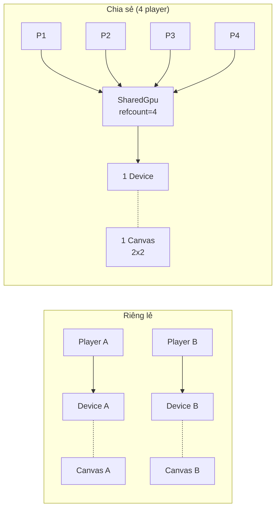
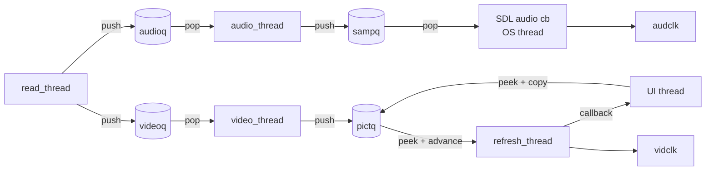
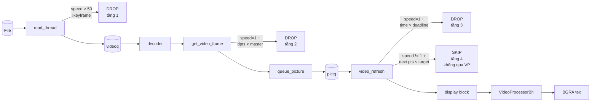

# MagicFFplay — Tài liệu chi tiết

## Mở đầu

`MagicFFplay.cpp` là một port C++ của `ffplay.c` (chương trình tham chiếu trong FFmpeg). Phần lớn code A/V sync, packet/frame queue, demux và SDL audio output được giữ nguyên ý từ upstream để dễ bảo trì khi ffplay.c update. Phần khác biệt nằm ở pipeline GPU và một số tính năng phục vụ use-case desktop editor: nhiều player chung 1 canvas, đổi speed `0.1x – 100x`, tone-map HDR sang SDR, push callback frame thay vì polling, GPU→GPU copy kiểu `MediaPlayer.CopyFrameToVideoSurface`.

Tổng cộng `MagicFFplay.cpp` ~2517 dòng. File `MagicFFplay.h` (~120 dòng) khai báo toàn bộ public C API. Mọi tương tác từ C# đi qua C++/CLI wrapper `MagicStudio.FFmpegPlus.Wrapper/MediaPlayerWrapper.cpp` rồi xuống façade `MagicStudio.FFmpegPlus/MagicFFplayPlayer.cs`. UI demo nằm trong `MagicStudio.UI/{MagicFFplay,DualFFplay,QuadFFplay}Control.xaml`.

Tài liệu này giả định người đọc đã biết qua kiến trúc của ffplay (3 thread chính: demux, decode, refresh + 1 thread audio do SDL quản lý). Nếu chưa, đoạn §2 sẽ tóm tắt lại trước khi đi vào phần thay đổi.

## 1. Tổng quan

Ở mức cao nhất, mỗi player là một `VideoState` chứa tất cả runtime: 3-4 thread, hai packet queue (audio/video), hai frame queue, ba clock, một GPU pipeline. Public API expose qua opaque handle `MagicFFplayHandle*` (wrap `VideoState*` + một staging texture cho CPU readback).

Sơ đồ duy nhất bạn cần nhớ là mạch dữ liệu một-chiều:

```
file ──► read_thread ──► packet queue ──► decoder thread ──► frame queue
                                                                  │
                                            video_refresh ────────┘
                                                  │
                                                  ▼
                                      VideoProcessor (NV12→BGRA)
                                                  │
                                                  ▼
                                          fp->tex (BGRA texture)
                                                  │
                                          on_frame_ready callback
                                                  │
                                                  ▼
                                     UI thread: CopyResource → CanvasControl
```

Bên cạnh đó, audio đi đường riêng: `audio_thread` decode ra `sampq`, SDL audio callback (chạy trên thread của OS) pull từ `sampq`, đẩy ra audio device, và đồng thời cập nhật `audclk` (audio master clock) — chính clock này được video dùng để A/V sync ở speed = 1.0.

### Hai chế độ GPU

Đây là phần dễ nhầm và quyết định nhiều thiết kế phía dưới. Có hai cách dùng:

**Chế độ riêng lẻ** (`magic_ffplay_open`): mỗi player tự tạo `FfplaySharedGpu` riêng — tức là tự `D3D11CreateDevice`, tự xài. Phù hợp khi mỗi player có CanvasControl riêng. Không player nào có thể render texture của player khác lên cùng canvas vì `CopyResource` cross-device crash, `CanvasBitmap.CreateFromDirect3D11Surface` cross-device throw.

**Chế độ chia sẻ** (`magic_ffplay_open_with_shared_gpu`): caller tạo trước một `FfplaySharedGpu` (refcount), rồi pass cho N player. Tất cả player nắm tay cùng 1 `ID3D11Device`. CanvasDevice cũng tạo từ DXGI device của shared GPU → có thể wrap texture của bất kỳ player nào trong N. Bắt buộc cho UI render nhiều video lên 1 canvas (xem `DualFFplayControl`, `QuadFFplayControl`).



`FfplaySharedGpu` refcounted bằng `std::atomic<int>`. Mỗi `magic_ffplay_open_with_shared_gpu` bump refcount; mỗi `magic_ffplay_close` giảm refcount. Khi refcount về 0 (caller cũng đã release ref của họ qua `magic_ffplay_shared_gpu_release`), device destroy.

---

## 2. Vòng đời và các luồng chính

### 2.1 Mở file

Bạn gọi `magic_ffplay_open(path)`. Hàm này làm `SDL_Init(AUDIO+TIMER)` (idempotent, gọi nhiều lần không sao), tạo `FfplaySharedGpu` mới (riêng lẻ), tạo `VideoState`, init queue/clock/cond, rồi spawn `read_thread` và `refresh_thread`. Sau đó nó **block** trên condition variable `prep_cond` cho đến khi `read_thread` báo đã prepared.

Cụ thể, `read_thread` chạy `avformat_open_input`, `avformat_find_stream_info`, mở audio/video stream component (gọi `stream_component_open` — sẽ tạo decoder thread tương ứng), rồi set `prepared = 1` và signal `prep_cond`. Lúc đó caller mới được unblock và `magic_ffplay_open` trả handle. Nhờ vậy, ngay sau khi `Open` trả về, `Duration` / `VideoSize` đã hợp lệ — không phải polling vòng `while (Duration == 0)`.

Mặc định `paused = 0` nên player chạy ngay sau open. Muốn pause: gọi `magic_ffplay_toggle_pause`.

`stream_component_open` cho video làm những việc đáng chú ý: gắn `create_hwaccel(D3D11VA)` để decoder dùng GPU; ép `thread_count = 1` (hw engine đã song song, FFmpeg multi-thread chỉ tốn CPU thừa); set `extra_hw_frames = VIDEO_PICTURE_QUEUE_SIZE + 4 = 20`. Số 20 này cần đủ để D3D11VA không bao giờ recycle một NV12 surface đang còn được giữ trong pictq (16 slot) + lookahead của decoder (~4 frame). Nếu thiếu, bạn sẽ thấy artifact dạng "checkerboard" khi pictq đầy.

### 2.2 Demux: `read_thread`

Sau khi prepared, `read_thread` chạy vòng vô hạn cho đến khi `abort_request`. Mỗi iteration:

1. Nếu trạng thái `paused` đổi → `av_read_pause` / `av_read_play` cho protocol nào hỗ trợ.
2. Nếu có `seek_req`: gọi `avformat_seek_file`, sau đó **flush cả audioq lẫn videoq**. Flush làm `++serial` ở mỗi queue — điểm này quan trọng vì frame còn nằm trong queue (chưa được decoder lấy) sẽ có `pkt->serial` cũ. Khi decoder kéo packet ra so với `q->serial` mới, nó nhận biết và flush internal buffer của decoder. Clock cũng dùng cơ chế tương tự: `get_clock` so `*queue_serial` với `c->serial`, mismatch trả NaN → frame cũ không kéo master clock lệch.
3. Back-pressure: nếu `audioq.size + videoq.size > MAX_QUEUE_SIZE (15 MiB)` hoặc cả hai stream đã có đủ packet (`stream_has_enough_packets`: `≥ 25 packet` và `≥ 1 giây duration`), thì block `continue_read_thread` 10ms. Đây là chỗ ngăn demuxer đọc thừa làm phình memory.
4. `av_read_frame` đọc packet. Lỗi/EOF: đẩy null packet vào mỗi queue (để decoder flush ra frame cuối), set `is->eof = 1`, block 10ms rồi continue.
5. **Speed-aware drop**: nếu `playback_speed > 50.0` và packet không phải keyframe, drop ngay tại demuxer. Lý do: ở speed cao decoder ceiling ~1500fps; nếu đẩy hết packet xuống, audioq bị starve vì videoq chiếm hết `MAX_QUEUE_SIZE`. Chấp nhận xem chỉ I-frame (cadence kém liên tục) thay vì freeze audio.
6. Ngược lại, `packet_queue_put` vào đúng queue theo `stream_index`.

### 2.3 Decode video: `video_thread`

`get_video_frame` gọi `decoder_decode_frame` (wrap `avcodec_send_packet/receive_frame`, handle serial mismatch sau seek) rồi áp một số tối ưu:

- **Decoder tuning theo speed**: `speed > 2.0` → `skip_loop_filter = AVDISCARD_ALL` (bỏ deblocking, ~30% decode CPU); `speed > 30.0` → `skip_frame = AVDISCARD_NONREF` (chỉ giữ I+P, ~15fps cadence).
- **Framedrop early**: chỉ active khi `playback_speed == 1.0` (và `s_framedrop > 0` hoặc auto + audio-master). Nếu `dpts - master_clock < 0` (frame trễ so audio), drop trước khi park vào pictq — tiết kiệm cả `VideoProcessorBlt` ở `video_refresh`. Tắt drop này ở speed != 1.0 vì target-PTS clock (xem §2.6) đã tự xử lý.

Sau khi qua được filter, frame đi vào `queue_picture`. Đây là bước nhỏ nhưng tinh tế: nó copy metadata (`pts, duration, pos, width, height, format, sar, serial`) sang slot trong pictq, release `vp->tex` cũ (under `pictq.mutex` để tránh race với consumer), nhưng **KHÔNG convert NV12→BGRA**. Việc convert được defer xuống `video_refresh`. Vì sao? Vì ở speed cao, nhiều frame sẽ bị skip trước khi đến lượt hiển thị; nếu convert eager thì lãng phí `VideoProcessorBlt`. `vp->frame` (NV12 hwframe) vẫn được giữ ref qua `av_frame_move_ref`, sẽ release ở `frame_queue_unref_item`.

### 2.4 Decode audio: `audio_thread`

Đơn giản hơn video. Loop `decoder_decode_frame` rồi push `AVFrame` vào `sampq` (9 slot). PTS được rescale về time-base `1/sample_rate` để sau đó audio clock tính dễ. Frame thiếu PTS thì bám `next_pts` (decoder tự duy trì).

### 2.5 SDL audio callback và clock

`sdl_audio_callback` là hàm OS audio thread gọi mỗi khi audio device cần data. Đây là **thread riêng do SDL/OS sinh ra**, không phải thread của MagicFFplay.

```
audio_callback_time = av_gettime_relative()   // anchor cho clock
consume cờ speed_changed → teardown filter graph nếu có
loop fill stream:
    nếu playback_speed != 1.0:
        audio_decode_frame_filtered (qua filter graph)
    else:
        audio_decode_frame (path đơn giản, không filter)
    copy hoặc mix vào stream (theo volume / mute)
set_clock_at(audclk, audio_clock - buffer_delay × speed, serial, audio_callback_time)
sync_clock_to_slave(extclk, audclk)
```

`audio_clock` được tính từ frame's PTS cộng với phần đã consume. Quan trọng là `buffer_delay`: SDL có internal buffer + driver buffer, sample đang đẩy ra DAC thực ra ứng với PTS cũ hơn `audio_clock` một khoảng. Trừ `(2 × audio_hw_buf_size + audio_write_buf_size) / bytes_per_sec` để bù delay. Nhân thêm `× playback_speed` vì mỗi byte trong SDL buffer ứng với `× speed` thời gian gốc (audio đang được time-stretch).

Kết quả: `audclk` cho ra PTS đúng với thời điểm sample đang phát thực sự. Video sync theo `audclk` chính xác đến cỡ 1 frame.

### 2.6 Audio filter chain (atempo / asetrate)

Khi `playback_speed != 1.0`, audio phải đi qua filter graph để time-stretch. Hai mode:

- **Pitch correction ON** (mặc định; **forced** khi `speed >= 5.0`): dùng `atempo`. Filter này áp dụng OLA (overlap-add) để stretch/shrink waveform mà giữ nguyên tần số. Vấn đề: `atempo` chỉ chính xác về số sample trong khoảng `[0.5, 2.0]`. Single `atempo=100` lệch ~1% sample, audio kéo dài ~1s sau khi video kết thúc.
- **Pitch correction OFF** (tape-like): dùng `asetrate=N×speed, aresample=N`. Sample rate giả tăng theo speed (giả vờ tape quay nhanh hơn), sau đó `aresample` về sample-rate device. Pitch shift theo speed, sound vintage.

`build_atempo_chain` xử lý vấn đề atempo:

```cpp
// speed < 0.5: prefix "atempo=0.5," cho đến khi rem in [0.5, 2.0]
// speed > 2.0: prefix "atempo=2.0," tương tự
// stage cuối: atempo=%.6f cho phần dư
```

Vd `speed = 5.0`: `"atempo=2.0,atempo=2.5"`. `speed = 100.0`: `"atempo=2.0,atempo=2.0,atempo=2.0,atempo=2.0,atempo=2.0,atempo=2.0,atempo=1.5625"`. Mỗi stage trong range well-behaved → tổng sample chính xác.

Filter graph lifecycle:
- `audio_filter_init` build lazy ở callback đầu tiên có `speed != 1.0` (cần format của frame mới configure abuffer).
- `magic_ffplay_set_speed` / `set_pitch_correction` chỉ set cờ `speed_changed = 1`, không block.
- Callback tiếp theo consume cờ qua `speed_changed->exchange(0)` → gọi `audio_filter_teardown`.
- `audio_decode_frame_filtered` thấy graph null → rebuild với speed/pitch hiện tại.

Một điểm tinh: PTS output của filter ở **output-time coordinates** (đã time-stretched). `audio_decode_frame_filtered` nhân `* playback_speed` để đưa PTS về **timeline gốc**, để `audclk` đồng pha với `vidclk` (vidclk dùng PTS gốc của frame).

### 2.7 Video refresh và A/V sync

`refresh_thread` chạy `video_refresh` mỗi 10ms (`REFRESH_RATE = 0.01`). Hàm này có hai nhánh tùy speed:

**Speed = 1.0** (audio-master A/V sync, giống ffplay gốc):

`compute_target_delay` lấy `diff = vidclk - master_clock`. Nếu `diff` âm vượt threshold (video chậm), giảm `delay`. Nếu `diff` dương vượt threshold và delay đã > 100ms, giữ frame thêm (`delay += diff`). Nếu dương + delay nhỏ, duplicate (`delay *= 2`).

Sau khi tính delay, check `time < frame_timer + delay` → chưa đến hạn, return (UI có cơ hội catch up). Đến hạn → `frame_timer += delay`, gọi `update_video_pts`, kiểm tra late drop (`time > frame_timer + next_duration` → drop frame, retry), rồi `frame_queue_next` advance rindex.

**Speed != 1.0** (target-PTS clock, không qua audio-master):

Tại sao đổi cơ chế? Vì audio buffer fluctuation ở speed cao làm audio-master sync không ổn — buffer căng/cạn liên tục, `diff` nhảy đột ngột, video bị lúc nhanh lúc chậm. Cách CapCut/Premiere làm fast-forward là dùng wall clock × speed.

```
wall_elapsed = (av_gettime_relative() - speed_base_wall_us) / 1e6
target_pts   = speed_base_pts + wall_elapsed * playback_speed
```

`speed_base_pts` và `speed_base_wall_us` được set lại trong `magic_ffplay_set_speed` (snapshot master clock + wall time) và rebase mỗi khi `serial` đổi (sau seek). Hàm `video_refresh` loop qua pictq: nếu frame next có pts ≤ target → `frame_queue_next` (skip frame hiện tại, **không convert**); nếu frame hiện tại pts ≤ target → mark shown, dừng. Frame được mark shown sẽ vào display: block và convert.

**Display block** (chung cho cả 2 nhánh):

Lấy `fp = peek_last(pictq)` (frame vừa được shown). Nếu `fp->tex == null` và `fp->frame->format == AV_PIX_FMT_D3D11`:

1. Lấy NV12 texture và slice từ `fp->frame->data[0]` và `data[1]`.
2. `frame_to_dxgi_color_space(fp->frame)` chọn `DXGI_COLOR_SPACE_TYPE` đúng. Quy tắc ưu tiên: PQ (`SMPTE2084`) → HLG (`ARIB_STD_B67`) → BT.2020 → BT.601 → BT.709 (default), kết hợp với studio/full range theo `color_range`.
3. `frame_to_hdr10_metadata` đọc `MASTERING_DISPLAY_METADATA` + `CONTENT_LIGHT_LEVEL` nếu có.
4. `ffplay_gpu_ensure_processor`: triple-cache. Recreate VideoProcessor khi `procW/procH` đổi; `SetStreamColorSpace1` khi inCs đổi; `SetStreamHDRMetaData` khi metadata đổi. Output luôn `RGB_FULL_G22_NONE_P709` → driver tự tone-map HDR PQ/HLG → SDR. Đây là lazy-init bậc 3, per-frame chỉ tốn `memcmp` 24 byte.
5. `ffplay_gpu_nv12_to_bgra` thực hiện blit (xem §3 về texture pool).
6. Park kết quả: lock `pictq.mutex`, set `fp->tex = bgra`, `fp->version = ++(*frame_version_seq)`.
7. `av_frame_unref(fp->frame)` ngay — trả NV12 surface về D3D11VA pool sớm (giảm áp lực `extra_hw_frames`).
8. Cuối cùng, nếu có `on_frame_ready` callback đăng ký → fire callback **trên refresh thread**. Caller (C++/CLI wrapper) marshal về UI thread tự lo.

### 2.8 UI consumer

UI có 3 đường lấy frame, chọn theo use-case:

| API | Khi nào | Cost |
|---|---|---|
| `acquire_current_texture` | 1 player / 1 canvas, wrap thẳng thành CanvasBitmap | AddRef texture + caller release. Lock pictq.mutex ngắn. |
| `copy_current_to_texture(dst)` | N player / 1 canvas, copy vào caller's render target | `CopyResource` GPU→GPU. dst phải cùng device + cùng size + BGRA. |
| `copy_current_bgra(dst_cpu)` | Snapshot / readback CPU (screenshot) | `CopyResource` → staging → `Map(READ)` → `memcpy` row-by-row. BLOCK CPU. |

`MagicFFplayPlayer.CopyFrameToVideoSurface` (C# façade) wrap đường thứ 2. Đường này khớp API `Windows.Media.Playback.MediaPlayer.CopyFrameToVideoSurface` để dễ migrate code có sẵn.

Push model thay vì polling: `magic_ffplay_set_frame_callback(h, cb, ctx)` register callback. C++/CLI wrapper expose event `VideoFrameAvailable` (tương đương `MediaPlayer.VideoFrameAvailable`). UI chỉ cần subscribe, callback sẽ fire mỗi khi BGRA park xong, không cần `DispatcherTimer` polling.

**Ví dụ UI flow trong `QuadFFplayControl`** (4 player, 1 canvas, vsync throttling):

1. Mỗi slot subscribe `VideoFrameAvailable`. Handler set `slot.PendingFrame = true` (volatile bool). Cờ này được gọi từ native refresh thread.
2. `CompositionTarget.Rendering` (event WinUI fire mỗi vsync ~16ms) gọi `OnCompositionRendering`.
3. Trong handler: duyệt 4 slot. Slot nào có `PendingFrame = true` → clear cờ, gọi `CopyFrameToVideoSurface(slot.Surface)` (chính là `magic_ffplay_copy_current_to_texture`). Nếu copy ok → mark `anyCopied = true`.
4. Cuối tick: nếu `anyCopied` → 1 lần `QuadCanvas.Invalidate()`.
5. Canvas Draw event: `DrawingSession.DrawImage(slot[i].Bitmap, rect)` với rect là một góc của layout 2x2.

Tác dụng: 4 player × tốc độ cao có thể fire hàng trăm frame event/giây trên native thread. Throttling coalesce xuống tối đa 60 copy + 60 invalidate/giây — đúng tần suất hữu ích cho display 60Hz.

### 2.9 Seek

`magic_ffplay_seek_us` → `stream_seek` → set `seek_pos / seek_rel / seek_flags / seek_req = 1`, signal `continue_read_thread`. Idempotent: nếu đã có seek pending, skip — caller không phải lo về thrashing khi user kéo slider liên tục (UI cũng nên throttle, nhưng đây là defensive).

`read_thread` thấy `seek_req` → `avformat_seek_file` → `packet_queue_flush(audioq + videoq)`. Flush bump serial → mọi frame còn cũ (trong queue, trong decoder, trong frame queue) sẽ bị reject theo cơ chế serial mismatch. Clock cũng trả NaN cho mọi frame còn cũ (vì `c->serial` khác `*c->queue_serial`).

Sau seek, `is->force_refresh = 1` (chỉ khi đang paused — để frame mới refresh ngay; nếu đang playing thì refresh thread sẽ tự lo).

### 2.10 Đổi speed

`magic_ffplay_set_speed(h, speed)` làm 4 việc, không block:

1. Snapshot `cur = get_master_clock(is)`.
2. Set `speed_base_pts = cur`, `speed_base_wall_us = now`. Đây là re-anchor target-PTS clock — frame tiếp theo sẽ có position = `cur + Δt × speed_mới`.
3. `playback_speed = av_clipd(speed, 0.1, 100.0)`.
4. `speed_changed->store(1)`, signal `continue_read_thread`. Signal để read_thread wake và refill queue (vì ở speed mới, audioq/videoq target size có thể khác).

Audio filter graph rebuild lazy. SDL audio callback tiếp theo consume cờ `speed_changed` → `audio_filter_teardown`. Frame tiếp theo qua `audio_decode_frame_filtered` thấy graph null → rebuild với speed mới (và pitch_correction hiện tại, hoặc forced ON nếu speed ≥ 5.0).

Video không cần làm gì — vòng `video_refresh` đã tự chuyển sang target-PTS path khi `playback_speed != 1.0`.

### 2.11 Đóng player

`magic_ffplay_close(h)` → `stream_close(is)`:

```
abort_request = 1
SDL_WaitThread(read_tid) + SDL_WaitThread(refresh_tid)
stream_component_close(audio_stream) + stream_component_close(video_stream)
  (mỗi cái: decoder_abort → SDL_CloseAudioDevice → decoder_destroy
   → audio_filter_teardown + swr_free cho audio)
avformat_close_input
destroy queues + cond + mutex
delete gpu (processor.Reset → enumerator.Reset → bgraPool.Reset → shared release)
delete speed_changed + frame_version_seq
av_free(is)
```

Trật tự destroy của FfplayGpu quan trọng: processor giữ ref vào `videoDevice` của shared. Phải reset processor trước, rồi shared release. ComPtr destructor tự lo, không cần làm thủ công nếu khai đúng thứ tự field.

---

## 3. Texture pool BGRA

Một trong những điểm GPU tốn nhất ở high-speed là `CreateTexture2D` mỗi frame trong `ffplay_gpu_nv12_to_bgra`. Mỗi call tạo descriptor heap entry mới + allocate GPU memory ~0.5-1ms. Ở 60fps × N giây sẽ tạo/destroy hàng nghìn texture.

`FfplayGpu` có pool 3 entry `ComPtr<ID3D11Texture2D>`. Trick để biết entry nào free: dùng chính D3D refcount. Pool giữ permanent 1 ref qua ComPtr; consumer/producer giữ thêm ref khi dùng. Khi refcount của texture xuống lại 1 → no one else holding → free.

Để đọc refcount mà không thay đổi ownership:

```cpp
ID3D11Texture2D* raw = slot.Get();
raw->AddRef();              // 1 → 2 (hoặc N+1)
ULONG count = raw->Release(); // 2 → 1 (Release trả về refcount mới)
if (count == 1) {
    raw->AddRef();          // claim, refcount: 2
    return raw;             // caller có 1 ref, pool giữ 1 ref
}
```

`Release()` returns the post-decrement refcount. Sau `AddRef + Release` thì refcount không đổi, nhưng ta có giá trị returned. Pool's permanent ref đảm bảo refcount không bao giờ về 0 nên Release không destroy.

Khi pool cạn (cả 3 đều đang in use): fallback `CreateTexture2D` one-shot. Caller's Release sẽ destroy texture đó. Pool size không tăng. Trường hợp này rất hiếm vì mỗi player tại 1 thời điểm chỉ giữ 1-2 BGRA texture đồng thời (frame đang shown + frame vừa produce).

Khi `procW/procH` đổi (video size khác hoặc seek qua segment khác resolution): pool `Reset()` toàn bộ entry. Consumer còn cầm AddRef giữ texture sống đến khi họ Release. Pool entries mới sẽ được CreateTexture2D ở lần acquire tiếp theo (lúc đó `!slot` evaluate true).

---

## 4. Threading model

Mỗi player tạo 4 thread của riêng nó: `read_thread` (demux), `video_thread` (decode video), `audio_thread` (decode audio), `refresh_thread` (A/V sync + NV12→BGRA). Cộng thêm thread của OS audio gọi `sdl_audio_callback`, và UI thread (WinUI dispatcher) gọi consumer API. Tổng ~5 thread per player tham gia data path.



Đồng bộ giữa các thread chia thành các nhóm:

**Packet queue** (`audioq`, `videoq`): bảo vệ bởi `q->mutex`. Reader: decoder thread. Writer: read_thread. Cond var để wake reader khi có packet.

**Frame queue** (`pictq`, `sampq`): bảo vệ bởi `f->mutex`. Reader: refresh_thread (peek + advance pictq), sdl_audio_callback (pop sampq qua filter graph hoặc trực tiếp). Writer: video_thread / audio_thread. Cond var hai chiều: `peek_writable` block khi queue đầy, `peek_readable` block khi rỗng.

**`fp->tex` field**: bảo vệ bởi cùng `pictq.mutex` ở các điểm: `queue_picture` (release tex cũ), `video_refresh` display block (assign tex mới), `acquire_current_texture` từ consumer (AddRef tex). Nhờ lock này, `tex->Release()` ở producer side không race với `tex->AddRef()` ở consumer side.

**Clock state**: dựa trên implicit memory ordering + atomic single-word writes. `audio_clock`, `audio_clock_serial` là plain int — aligned writes là atomic trên x86/x64. `audclk.pts_drift / last_updated / pts` được set together trong `set_clock_at`; reader (`get_clock`) đọc nhất quán nhờ x86 strong ordering.

**Speed change**: `speed_changed` là `std::atomic<int>`. Writer (`set_speed`/`set_pitch_correction`) `.store(1)`. Reader (`audio_decode_frame`) `.exchange(0)` — atomic read-modify-write, đảm bảo chỉ 1 consumer thấy cờ và trigger teardown.

**Frame version**: `frame_version_seq` là `std::atomic<uint64>`. Writer: `video_refresh`. Reader: UI poll, refresh thread, `acquire_current_texture`.

**D3D11 context**: bảo vệ kép. `SetMultithreadProtected(TRUE)` cho driver tự lock context giữa nhiều caller. Thêm `bltMutex` (`std::mutex`) ở app-level serialize cụ thể `VideoProcessorBlt + CopyResource + Map` — tránh acquisition overhead lặp khi 1 thao tác cần nhiều lock của driver. `ffmpegLock` (`std::recursive_mutex`) gắn vào `AVD3D11VADeviceContext.lock/unlock` — recursive vì FFmpeg hwaccel có thể nested-lock trong cùng thread.

---

## 5. Constants tham chiếu

Buffer / queue:

| Constant | Giá trị | Vai trò |
|---|---|---|
| `MAX_QUEUE_SIZE` | 15 MiB | Trần `audioq.size + videoq.size`. |
| `MIN_FRAMES` | 25 | `stream_has_enough_packets` cần ≥ 25 packet và ≥ 1s duration. |
| `VIDEO_PICTURE_QUEUE_SIZE` | 16 | Slot pictq. |
| `SAMPLE_QUEUE_SIZE` | 9 | Slot sampq. |
| `FRAME_QUEUE_SIZE` | 16 | Static array `FrameQueue.queue[]`. |
| `extra_hw_frames` | 20 | D3D11VA pool size = pictq + 4 đệm. |
| `bgraPool size` | 3 | BGRA texture mỗi player. |
| `SDL_AUDIO_MIN_BUFFER_SIZE` | 512 | Lower bound `audio_hw_buf_size`. |

A/V sync:

| Constant | Giá trị | Vai trò |
|---|---|---|
| `REFRESH_RATE` | 10ms | Tick refresh_thread. |
| `AV_SYNC_THRESHOLD_MIN/MAX` | 40ms / 100ms | Cửa sổ "đồng bộ". |
| `AV_SYNC_FRAMEDUP_THRESHOLD` | 100ms | Trên ngưỡng giữ frame, dưới duplicate. |
| `AV_NOSYNC_THRESHOLD` | 10s | Master snap slave khi drift quá lớn. |
| `SAMPLE_CORRECTION_PERCENT_MAX` | 10 | Clamp drift correction ±10%. |
| `AUDIO_DIFF_AVG_NB` | 20 | EMA window cho audio drift. |

Speed tuning:

| Threshold | Action |
|---|---|
| `speed > 2.0` | `skip_loop_filter = AVDISCARD_ALL` |
| `speed >= 5.0` | Pitch correction forced ON (atempo) |
| `speed > 30.0` | `skip_frame = AVDISCARD_NONREF` |
| `speed > 50.0` | Demuxer drop non-key video packet |
| `speed` clamp | `[0.1, 100.0]` |

External clock (chỉ relevant với realtime stream):

| Constant | Giá trị |
|---|---|
| `EXTERNAL_CLOCK_MIN_FRAMES` | 2 |
| `EXTERNAL_CLOCK_MAX_FRAMES` | 10 |
| `EXTERNAL_CLOCK_SPEED_MIN/MAX/STEP` | 0.900 / 1.010 / 0.001 |

File-scope tunable:

```cpp
static int s_framedrop           = -1;  // -1=auto, 0=off, 1=always
static int s_decoder_reorder_pts = -1;  // auto vs pkt_dts vs best_effort
static int s_av_sync_type        = AV_SYNC_AUDIO_MASTER;
```

---

## 6. Cấu trúc dữ liệu

`FfplaySharedGpu` chứa D3D11 device + context + DXGI device + video device + video context (cần `ID3D11VideoContext2` cho ColorSpace1 + HDR metadata, fatal nếu QI fail), `bltMutex`, `ffmpegLock`, `refcount`.

`FfplayGpu` (per-player) chứa pointer tới shared, VideoProcessor + enumerator (cache theo `procW/procH/inColorSpace/hdrMeta`), `bgraPool[3]` + `poolW/H`.

`VideoState` là cấu trúc lớn nhất, chia thành các nhóm field:

- **Threads / control**: thread handle, abort_request, paused, seek_*, prep_mutex/cond/prepared, continue_read_thread.
- **Format**: `AVFormatContext* ic`, audio_st/video_st, filename, max_frame_duration.
- **Clocks**: audclk, vidclk, extclk, av_sync_type, frame_timer.
- **Queues**: pictq, sampq (FrameQueue) + audioq, videoq (PacketQueue).
- **Decoders**: auddec, viddec.
- **Audio runtime**: audio_buf, audio_buf1, audio_clock, audio_diff_*, swr_ctx, audio_dev, audio_volume, muted, audio_src/audio_tgt (AudioParams cached).
- **Counter**: frame_drops_early/late.
- **GPU**: `FfplayGpu* gpu`, `std::atomic<uint64>* frame_version_seq`.
- **Speed**: playback_speed, pitch_correction, `std::atomic<int>* speed_changed`, speed_base_pts, speed_base_wall_us, filter graph fields (`af_graph, af_src, af_sink, af_serial`).
- **Push callback**: `on_frame_ready, frame_callback_ctx`.

`Frame` chứa `AVFrame* frame` (NV12 hwframe hoặc audio frame), metadata (serial, pts, duration, w, h, format, sar), `ID3D11Texture2D* tex` (BGRA, AddRef'd), `uint64_t version`.

`FrameQueue` là vòng tròn `queue[16]` với `rindex/windex/size/max_size/keep_last/rindex_shown`. `keep_last = 1` cho cả pictq và sampq để frame cuối được giữ làm "currently shown" cho consumer peek.

`PacketQueue` là `AVFifo` autogrow + serial + mutex + cond. Serial bump khi flush.

`Clock` chứa `pts, pts_drift, last_updated, speed, serial, paused`, và pointer `queue_serial` (trỏ tới `audioq.serial`, `videoq.serial`, hoặc `extclk.serial` chính nó). `get_clock` so `*queue_serial != c->serial` → trả NaN.

`MagicFFplayHandle` wrap `VideoState*` + staging texture cho CPU readback (`magic_ffplay_copy_current_bgra`) + `staging_mutex`.

---

## 7. Public API tham chiếu

Lifecycle:

```cpp
MagicFFplayHandle*    magic_ffplay_open(const char* path);
MagicFFplayHandle*    magic_ffplay_open_with_shared_gpu(const char*, MagicFFplaySharedGpu*);
void                  magic_ffplay_close(MagicFFplayHandle*);

MagicFFplaySharedGpu* magic_ffplay_shared_gpu_create();
void                  magic_ffplay_shared_gpu_release(MagicFFplaySharedGpu*);
int                   magic_ffplay_shared_gpu_acquire_dxgi_device(MagicFFplaySharedGpu*, IDXGIDevice**);
```

Playback control:

```cpp
void    magic_ffplay_toggle_pause    (MagicFFplayHandle*);
int     magic_ffplay_is_paused       (MagicFFplayHandle*);
void    magic_ffplay_seek_us         (MagicFFplayHandle*, int64_t us);
void    magic_ffplay_step_frame      (MagicFFplayHandle*);

void    magic_ffplay_set_speed       (MagicFFplayHandle*, double);  // [0.1, 100.0]
double  magic_ffplay_get_speed       (MagicFFplayHandle*);
void    magic_ffplay_set_pitch_correction(MagicFFplayHandle*, int); // 1/0
int     magic_ffplay_get_pitch_correction(MagicFFplayHandle*);

void    magic_ffplay_set_volume      (MagicFFplayHandle*, double);  // [0.0, 1.0]
double  magic_ffplay_get_volume      (MagicFFplayHandle*);
void    magic_ffplay_set_mute        (MagicFFplayHandle*, int);
int     magic_ffplay_get_mute        (MagicFFplayHandle*);
```

Frame / texture access:

```cpp
int     magic_ffplay_acquire_current_texture (MagicFFplayHandle*, ID3D11Texture2D**);
uint64_t magic_ffplay_current_frame_version  (MagicFFplayHandle*);
int     magic_ffplay_copy_current_bgra       (MagicFFplayHandle*, uint8_t* dst, int cap, int* w, int* h);
int     magic_ffplay_copy_current_to_texture (MagicFFplayHandle*, ID3D11Texture2D* dst);
int     magic_ffplay_acquire_dxgi_device     (MagicFFplayHandle*, IDXGIDevice**);

void    magic_ffplay_set_frame_callback      (MagicFFplayHandle*, MagicFFplayFrameCallback, void* ctx);
```

Metadata:

```cpp
int64_t magic_ffplay_master_clock_us  (MagicFFplayHandle*);
double  magic_ffplay_duration_seconds (MagicFFplayHandle*);
int     magic_ffplay_video_size       (MagicFFplayHandle*, int* w, int* h);
```

---

## 8. Tối ưu performance đã áp dụng

Mục này gom các kỹ thuật performance trong code, sắp theo nhóm: pipeline GPU, threading, A/V sync, framedrop, speed-aware decode, UI consumer. Mỗi mục giải thích **vấn đề gốc**, **giải pháp**, **cơ chế hoạt động**, và **trade-off / edge case** đáng để ý.

### 8.1 Pipeline GPU

#### 8.1.1 Shared GPU refcounted cho multi-player

**Vấn đề**. Khi muốn render nhiều video trên 1 canvas (chia layout 2×2 chẳng hạn), nếu mỗi player tự tạo `ID3D11Device` riêng thì không cách nào composite chúng lại. `ID3D11DeviceContext::CopyResource` crash khi source/dest khác device. `CanvasBitmap.CreateFromDirect3D11Surface` throw `InvalidArgumentException` khi surface không bám device của `CanvasDevice`. Shared texture qua handle (`OpenSharedResource1`) chạy được nhưng tăng latency và quản lý handle phức tạp.

**Giải pháp**. Tách `FfplaySharedGpu` thành object refcounted (atomic int), nắm các COM object dùng chung: `ID3D11Device`, `ID3D11DeviceContext`, `IDXGIDevice`, `ID3D11VideoDevice`, `ID3D11VideoContext / VideoContext2`. Caller tạo trước qua `magic_ffplay_shared_gpu_create()` (refcount=1), pass cho N player qua `magic_ffplay_open_with_shared_gpu(path, shared)` — mỗi player addref. Canvas device cũng tạo từ DXGI device của shared GPU.

**Lifecycle**. Caller giữ 1 ref (release qua `magic_ffplay_shared_gpu_release`). Mỗi player giữ 1 ref (release khi `magic_ffplay_close`). Khi tất cả ref drop → device destroy. Atomic `fetch_sub(1, acq_rel)` đảm bảo memory ordering — không player nào còn dùng device khi nó bị destroy.

**Trade-off**. Mọi GPU operation từ tất cả player serialize qua cùng `ID3D11DeviceContext`. Có `bltMutex` (§8.2.4) bao bọc chỗ nóng nhất. Trên modern GPU, serialization này không phải bottleneck — decode/blit chạy trên hardware engine song song; chỉ command submission mới qua context.

#### 8.1.2 Zero-copy GPU path

**Vấn đề**. Decode video CPU-side (libavcodec software) cho ra `AVFrame` chứa buffer CPU (YUV planar) → muốn vẽ phải `memcpy` lên GPU texture → CPU bandwidth tốn, latency cao. Hơn nữa, `CanvasBitmap.CreateFromBytes` lại copy thêm lần nữa nội bộ.

**Giải pháp**. Dùng D3D11VA hardware decoder. Decoder output là `AVFrame` với `format == AV_PIX_FMT_D3D11`, `data[0]` là `ID3D11Texture2D*` (NV12 array texture do D3D11VA decode trực tiếp xuống), `data[1]` là array slice index. Frame không bao giờ rời GPU.

`VideoProcessorBlt` chuyển NV12 → BGRA hoàn toàn trên GPU (driver dùng video engine riêng). Output là texture mới với `BindFlags = RENDER_TARGET | SHADER_RESOURCE`. Win2D wrap qua `QueryInterface(IID_IDXGISurface)` → `CreateDirect3D11SurfaceFromDXGISurface` → `CanvasBitmap.CreateFromDirect3D11Surface`. Toàn bộ chain không có CPU memcpy.

**Đường data đầy đủ**:

```
H.264 bitstream (file) ──► CPU demux ──► packet ──► D3D11VA decoder
                                                          │
                                                          ▼
                                              NV12 array texture (GPU memory)
                                                          │
                                                          ▼ VideoProcessorBlt
                                                          │
                                                  BGRA texture (GPU memory)
                                                          │
                                                          ▼ CopyResource
                                                          │
                                              CanvasRenderTarget (cùng device)
                                                          │
                                                          ▼ Win2D Draw
                                                          │
                                                Canvas backbuffer ──► monitor
```

Đường duy nhất CPU đụng vào data là demux (~5% overhead) — phần còn lại ở GPU.

**Trade-off**. Bắt buộc decoder cùng device với canvas. Đó là lý do `create_hwaccel` share `g->shared->device` cho `AVD3D11VADeviceContext.device` (chứ không cho FFmpeg tự alloc device riêng).

#### 8.1.3 Texture pool BGRA (refcount trick)

**Vấn đề**. `ffplay_gpu_nv12_to_bgra` mặc định mỗi frame `CreateTexture2D` BGRA mới. Mỗi call ~0.5-1ms (alloc GPU memory page, register vào descriptor heap, set state). Ở 4 player × 10x speed = vài trăm allocation/giây → fragmentation GPU heap + overhead command list lớn.

**Giải pháp**. Pool 3 `ComPtr<ID3D11Texture2D>` per player. Khi convert: scan pool, tìm entry free, reuse. Khó nhất: làm sao biết entry nào free?

**Cơ chế**. Pool giữ permanent 1 ref qua ComPtr. Lúc cấp cho producer: AddRef → refcount = 2. Lúc consumer acquire (UI side): AddRef → 3. Lúc consumer Release: 3 → 2. Lúc `frame_queue_unref_item` (producer release): 2 → 1. Khi refcount về 1 thì chỉ còn ref của pool — không ai khác đang dùng.

Test refcount mà không thay đổi ownership:

```cpp
ID3D11Texture2D* raw = slot.Get();
raw->AddRef();                    // refcount += 1
ULONG count = raw->Release();     // refcount -= 1, return value = post-decrement
                                  // (net change = 0, nhưng có biết refcount mới)
if (count == 1) {
    raw->AddRef();                // claim, refcount: 2
    return raw;
}
```

COM's `AddRef`/`Release` atomic theo spec. Trong bối cảnh chỉ refresh_thread acquire pool (1 producer), UI consumer chỉ AddRef tại điểm đã biết `fp->tex` non-null (sau khi producer commit), không có race.

**Edge case 1 — pool cạn**. Cả 3 entry đều đang in use (refcount > 1). Fallback `CreateTexture2D` one-shot. Trả về với `ComPtr::Detach()` (chuyển ownership cho caller). Texture này không vào pool, caller's Release sẽ destroy. Hiếm khi xảy ra — mỗi player chỉ giữ ~2 texture đồng thời (current shown + freshly produced).

**Edge case 2 — resize**. Khi `procW/procH` đổi (vd seek qua segment khác resolution): `Reset()` toàn bộ pool. Pool's ref drop, refcount giảm 1. Texture còn ref của consumer/producer giữ sống tiếp đến khi họ Release tự nhiên (an toàn, không use-after-free). Pool entries mới được CreateTexture2D ở lần acquire tiếp theo.

**Impact**. Trong 4 player × 10x speed: trước phase này GPU usage 100%, sau ~50-70% (combine với vsync throttle §8.6.1). Texture pool đóng góp phần lớn — `CreateTexture2D` là hot path D3D11 đắt nhất khi alloc nhiều.

#### 8.1.4 HDR tone-map qua driver

**Vấn đề**. HDR PQ (`SMPTE2084`) và HLG (`ARIB_STD_B67`) cần decode (1.0 = ~10000 nit) rồi tone-map xuống SDR (~100 nit) để display SDR monitor. Tone-map curve nontrivial — Hable, Reinhard, BT.2390 đều có tradeoff về highlight/shadow.

**Giải pháp**. Để driver làm. `frame_to_dxgi_color_space` map AVFrame metadata sang `DXGI_COLOR_SPACE_TYPE` đúng (priority: PQ → HLG → BT.2020 → BT.601 → BT.709). `ffplay_gpu_ensure_processor` set:

```cpp
VideoProcessorSetStreamColorSpace1(in_cs);   // PQ/HLG/SDR đúng curve
VideoProcessorSetOutputColorSpace1(DXGI_COLOR_SPACE_RGB_FULL_G22_NONE_P709);
VideoProcessorSetStreamHDRMetaData(HDR10, mastering_display + content_light);
```

Driver tự ST.2084/HLG decode → linear scene → tone-map curve nội bộ → BT.709 gamma encode. `HDR10` metadata từ AVFrame side-data (mastering display luminance, content light level) giúp driver chọn curve hợp lý với master cụ thể.

**Code đọc HDR10 metadata** (đáng chú ý vì unit conversion):

```cpp
// AVFrame primaries là AVRational [0..1]; DXGI dùng integer × 50000
out.RedPrimary[0] = (UINT16)(av_q2d(md->display_primaries[0][0]) * 50000.0);
// AVFrame luminance là nit; DXGI: max ×1, min ×10000
out.MaxMasteringLuminance = (UINT)(av_q2d(md->max_luminance) * 1.0);
out.MinMasteringLuminance = (UINT)(av_q2d(md->min_luminance) * 10000.0);
```

**Trade-off**. Tone-map curve khác giữa Intel/AMD/NVIDIA driver — kết quả không bit-exact. Cải tiến tương lai (§9): viết HLSL shader Win2D tone-map (Hable hoặc BT.2390) cho deterministic output.

#### 8.1.5 Lazy re-init các stage

**Vấn đề**. Mỗi frame potential phải re-configure VideoProcessor, swr_ctx, filter graph — nếu re-init naive thì hot path tốn 1-2ms/frame.

**Giải pháp triple-cache trong `ensure_processor`**. So 3 dimension độc lập:

```cpp
const bool sizeChanged   = !g->processor || g->procW != w || g->procH != h;
const bool colorChanged  = inCs != g->inColorSpace;
const bool metaChanged   = (hdrMeta != nullptr) != g->hasHdrMeta ||
                           (hdrMeta && memcmp(hdrMeta, &g->hdrMeta, sizeof(*hdrMeta)) != 0);

if (sizeChanged)                          recreate processor + enumerator;
if (sizeChanged || colorChanged)          SetStreamColorSpace1 + SetOutputColorSpace1;
if (sizeChanged || metaChanged)           SetStreamHDRMetaData;
```

Per-frame overhead: 2 int compare + 1 enum compare + 1 `memcmp(24 bytes)`. Bình thường mọi field unchanged → cost gần 0.

**Tương tự cho `swr_ctx`**. Cache `audio_src` (format/freq/ch_layout). So khi frame mới đến; re-init chỉ khi khác. Audio thường constant format trong suốt file → re-init 1 lần ở frame đầu.

**Filter graph (atempo/asetrate)**. Lazy build ở `audio_decode_frame_filtered` khi `af_graph == nullptr`. Teardown khi `speed_changed` cờ được consume (atomic `exchange(0)`). Không rebuild đồng bộ trong `set_speed` (sẽ block caller) — defer cho audio thread.

### 8.2 Threading và đồng bộ

#### 8.2.1 Decouple render loop khỏi UI

**Vấn đề**. Nếu A/V sync chạy trên UI thread (vd `DispatcherTimer`), khi UI bận (resize cửa sổ, popup dialog, layout pass) thì sync trượt → audio và video lệch.

**Giải pháp**. `refresh_thread` là SDL_Thread riêng, chạy `video_refresh` mỗi 10ms độc lập với UI thread. UI thread chỉ làm việc rất nhẹ: nhận callback `on_frame_ready` → marshal sang DispatcherQueue → `CopyFrameToVideoSurface` (~0.1ms) → `Invalidate`.

`pictq.rindex` advance đúng nhịp PTS bất kể UI có vẽ hay không. UI thread bị stall không kéo theo audio drift.

**Trade-off**. Cần memory ordering chuẩn giữa refresh_thread và UI thread. `pictq.mutex` lock `fp->tex` Release/AddRef serialize đúng cách. `frame_version_seq` atomic uint64 cho UI poll cheap.

#### 8.2.2 Push callback thay polling

**Vấn đề**. UI polling `DispatcherTimer` 60Hz: nếu video 24fps thì 36/60 tick là wasted (frame chưa mới). Worst case timer phase lệch vsync → frame mới sẵn sàng nhưng UI poll sau ~16ms.

**Giải pháp**. `magic_ffplay_set_frame_callback(h, cb, ctx)` đăng ký callback fire trên refresh_thread mỗi khi BGRA texture park thành công. C++/CLI wrapper expose event `VideoFrameAvailable` (giống `MediaPlayer.VideoFrameAvailable`).

UI subscribe sự kiện, handler chỉ marshal qua DispatcherQueue (hoặc `CompositionTarget.Rendering` cho throttling). Không có timer polling.

**Trade-off**. Callback chạy trên thread của native lib — caller PHẢI marshal về UI thread trước khi đụng đến UI element. Document rõ điểm này (giống `MediaPlayer.VideoFrameAvailable`).

#### 8.2.3 Frame version stamp

**Vấn đề**. Ngay cả khi có push callback, UI vẫn có thể tự repaint (vd vsync, layout change) — đụng vào texture chưa đổi → rewrap `CanvasBitmap` không cần thiết (alloc IDXGISurface wrapper, AddRef texture).

**Giải pháp**. `frame_version_seq` là `std::atomic<uint64_t>`, tăng mỗi khi BGRA park trong `video_refresh`:

```cpp
fp->version = bgra ? ++(*is->frame_version_seq) : 0;
```

UI giữ `_lastVersion`. Trước khi rewrap CanvasBitmap, gọi `magic_ffplay_current_frame_version` (cheap, lock pictq.mutex ngắn) và so. Bằng → skip rewrap. Khác → wrap mới + update `_lastVersion`.

Atomic uint64 đảm bảo không tear giữa producer write và reader read.

#### 8.2.4 Multithread-protected D3D11 + bltMutex

**Vấn đề**. ID3D11DeviceContext không thread-safe theo mặc định. Nhưng decoder thread (qua FFmpeg hwaccel), refresh_thread (VideoProcessorBlt), UI thread (CopyResource) đều cần context. Race → driver crash hoặc texture corruption.

**Giải pháp 3 lớp lock**:

1. **Driver-level**: `D3D10Multithread::SetMultithreadProtected(TRUE)` — driver tự lock internal critical section cho mỗi context call. Đảm bảo correctness baseline.
2. **App-level `bltMutex`** (`std::mutex` trên `FfplaySharedGpu`): bao bọc `VideoProcessorBlt + CopyResource + Map` cụ thể. Tránh overhead acquire-release lặp khi 1 operation cần nhiều context call (ví dụ Blt rồi Map cần lock một lần thôi).
3. **FFmpeg-level `ffmpegLock`** (`std::recursive_mutex` trên `FfplaySharedGpu`): gắn vào `AVD3D11VADeviceContext.{lock, unlock, lock_ctx}`. FFmpeg hwaccel internal đôi khi nested-call cùng thread → cần recursive.

**Cơ chế lồng nhau**:

```
UI: CopyFrameToVideoSurface
 └── bltMutex.lock()                          ← app-level
      └── context->CopyResource()
           └── driver internal lock           ← driver-level
                └── (... GPU work submit)
           driver internal unlock
      bltMutex.unlock()

FFmpeg decoder thread:
 └── ffmpegLock.lock() (callback)             ← FFmpeg-level
      └── decoder hwaccel work
           └── (ID3D11VideoDecoder calls)
                └── driver internal lock      ← driver-level
                     ...
      ffmpegLock.unlock()
```

3 lớp này không deadlock vì ordering nhất quán: app code không acquire ffmpegLock; FFmpeg code không acquire bltMutex; driver internal lock luôn ở dưới cùng.

#### 8.2.5 Pool D3D11VA frame đủ lớn

**Vấn đề**. D3D11VA decoder dùng pool NV12 surface (array texture với nhiều slice) để giữ output frame. Pool size mặc định FFmpeg ~4-8 → khi pictq đầy (giữ 16 frame), decoder hết slice mới và **recycle slice còn được tham chiếu** → frame trong pictq bị overwrite → artifact dạng "checkerboard pattern" hoặc "torn frame".

**Giải pháp**. `extra_hw_frames = VIDEO_PICTURE_QUEUE_SIZE + 4 = 20`. Đủ buffer cho 16 slot pictq + 4 đệm decoder lookahead (B-frame reorder).

Đặt trong `stream_component_open`:

```cpp
avctx->extra_hw_frames = VIDEO_PICTURE_QUEUE_SIZE + 4;
```

**Edge case**. Nếu giảm `VIDEO_PICTURE_QUEUE_SIZE` (vd về 3 như ffplay gốc), `extra_hw_frames` cũng phải giảm tương ứng — nhưng pool quá nhỏ làm decoder stall ở B-frame reorder. Trade-off cân bằng.

### 8.3 Pipeline data

#### 8.3.1 Defer NV12→BGRA xuống display block

**Vấn đề**. Nếu convert NV12→BGRA ngay trong `queue_picture` (sau decode, trước khi push vào pictq), thì mọi frame đều phải qua VideoProcessorBlt — kể cả những frame sẽ bị skip ở fast-forward (speed cao). Lãng phí GPU.

**Giải pháp**. `queue_picture` chỉ giữ `AVFrame*` NV12 hwframe và metadata (`vp->frame = src_frame`, `vp->tex = nullptr`). Convert được defer đến display block của `video_refresh`:

```mermaid
flowchart LR
    Dec[decoder<br/>NV12 hwframe] --> QP[queue_picture<br/>park vào pictq]
    QP --> P0[fp[0]: NV12, tex=null]
    QP --> P1[fp[1]: NV12, tex=null]
    QP --> P2[fp[2]: NV12, tex=null]
    P2 -.->|"speed != 1<br/>skip"| Skip[NV12 unref<br/>không qua VP]
    P1 -.->|"speed != 1<br/>skip"| Skip
    P0 -->|"chọn show"| VP[VideoProcessorBlt<br/>chỉ frame này tốn cost]
    VP --> BGRA[fp[0].tex = bgra]
```

Frame skip qua `frame_queue_next` → `frame_queue_unref_item` chỉ `av_frame_unref` NV12 (rẻ, chỉ decrement refcount, slice quay lại D3D11VA pool). **KHÔNG** đi qua VideoProcessorBlt.

Ở speed 10x với 30fps source, target-PTS chọn ~6 frame/giây để hiển thị (60Hz / 10 phù hợp với speed = 10), 24 frame còn lại bị skip → tiết kiệm 80% VP cost.

#### 8.3.2 Unref NV12 ngay sau convert

**Vấn đề**. NV12 surface là tài nguyên đắt (1080p NV12 ~3 MB, 4K ~12 MB). D3D11VA pool có giới hạn. Nếu giữ NV12 trong `fp->frame` đến lúc frame slot tái sử dụng (qua `frame_queue_next`), thì NV12 chiếm slot trong D3D11VA pool đến lúc đó — pool có thể cạn → decoder stall.

**Giải pháp**. Trong display block, ngay sau khi convert NV12 → BGRA thành công:

```cpp
if (bgra) {
    av_frame_unref(fp->frame);   // trả NV12 slice về D3D11VA pool
    frame_updated = true;
}
```

NV12 không cần giữ — đã có BGRA copy trong `fp->tex`. D3D11VA slice quay lại pool dùng cho frame tiếp theo. `frame_queue_unref_item` gọi `av_frame_unref` lần nữa khi recycle slot — idempotent (an toàn).

#### 8.3.3 Bounded queues + back-pressure

**Vấn đề**. Demuxer chạy nhanh hơn decoder/consumer → packet queue phình → memory bloat → OOM với file lớn (multi-GB).

**Giải pháp 2 ngưỡng**:

```cpp
if (audioq.size + videoq.size > MAX_QUEUE_SIZE ||      // 15 MiB
    (stream_has_enough_packets(audio) &&               // ≥ 25 packet và ≥ 1s
     stream_has_enough_packets(video))) {
    SDL_CondWaitTimeout(continue_read_thread, wait_mutex, 10);
    continue;
}
```

Ngưỡng đôi: byte limit cho protection memory; packet+duration limit cho throughput control (vd stream 4K 60fps có duration cao nhưng byte có thể chưa đến 15 MiB). Block 10ms qua cond — `SDL_CondSignal(continue_read_thread)` từ `set_speed`, seek, hoặc decoder consume xong sẽ unblock.

`frame_queue_peek_writable` block trên cond — `video_thread` / `audio_thread` không spin khi consumer (refresh_thread / audio callback) chậm:

```cpp
while (f->size >= f->max_size && !f->pktq->abort_request)
    SDL_CondWait(f->cond, f->mutex);
```

#### 8.3.4 Buffer-delay anchor cho audio clock

**Vấn đề**. `audio_clock` (PTS của sample đang được decode/convert) khác PTS thực sự đang **phát ra DAC**. SDL có internal buffer (~`audio_hw_buf_size`), driver có buffer riêng. Sample đẩy vào SDL chậm hơn sample DAC khoảng `buffer_delay`. Nếu `audclk = audio_clock` thẳng → video sync sớm hơn audio ~50-100ms (lipsync sai).

**Giải pháp**. Trong `sdl_audio_callback`, tính:

```cpp
// audio_callback_time = av_gettime_relative() đã set ở đầu callback
const double spd = is->playback_speed;
set_clock_at(&is->audclk,
    is->audio_clock - (double)(2 * is->audio_hw_buf_size + is->audio_write_buf_size) /
                      is->audio_tgt.bytes_per_sec * spd,
    is->audio_clock_serial,
    is->audio_callback_time / 1000000.0);
```

Trừ `(2 × hw_buf + write_buf) / bytes_per_sec`. `× 2` cho SDL double-buffering. `× speed` vì mỗi byte trong SDL buffer ứng với `× speed` thời gian gốc (audio đã time-stretched).

`audclk` cho ra PTS đúng thời điểm sample đang phát thật → A/V sync chính xác đến cỡ 1 frame video.

### 8.4 Framedrop nhiều tầng

Drop frame ở nhiều giai đoạn để giữ A/V sync và bound GPU usage. Mỗi tầng xử lý một loại "trễ" khác nhau:



**Tầng 1 — Demux drop** (`read_thread`, line ~2107). Active khi `speed > 50`. Drop non-key video packet ngay tại demuxer. Decoder chỉ thấy I-frame. Tiết kiệm cả decoder ceiling (decoder không thể vượt ~1500fps decode) và memory queue. Audio không bị starve khi videoq không nuốt hết `MAX_QUEUE_SIZE`.

**Tầng 2 — Decode early drop** (`get_video_frame`, line ~1273). Active khi `playback_speed == 1.0`, audio-master, và `s_framedrop > 0 || auto`. So `dpts - master_clock < 0` → frame trễ → `av_frame_unref` + `++frame_drops_early`, return 0. Tiết kiệm cả VideoProcessorBlt (frame trễ không vào pictq). Tắt drop này khi speed != 1.0 vì master clock (audclk) advance Nx wall time, video sẽ luôn "trễ" theo audclk → tầng này sẽ drop hết.

**Tầng 3 — Display late drop** (`video_refresh` speed=1.0 path, line ~1153). Sau khi `frame_queue_next` ra `vp`, nếu còn frame next và `time > frame_timer + next_duration` → `++frame_drops_late`, `frame_queue_next` lần nữa, `goto retry`. Drop sau decode nhưng trước Convert — vẫn còn tiết kiệm VP cost.

**Tầng 4 — Lazy convert skip** (`video_refresh` speed != 1.0 path). Không gọi "drop" theo nghĩa counter, nhưng tác dụng tương đương: `target_pts` loop advance qua nhiều frame `frame_queue_next` (skip current vp, fp = next vp). Frame bị skip không bao giờ vào display block → không qua VideoProcessorBlt. Đây là cơ chế quan trọng nhất ở speed cao (kết hợp với §8.3.1 defer NV12→BGRA).

### 8.5 Speed-aware decode

#### 8.5.1 Decoder tuning theo speed

`get_video_frame` (line ~1252) dynamic adjust decoder options:

```cpp
const double spd = is->playback_speed;
is->viddec.avctx->skip_loop_filter =
    (spd > 2.0) ? AVDISCARD_ALL : AVDISCARD_DEFAULT;
is->viddec.avctx->skip_frame =
    (spd > 30.0) ? AVDISCARD_NONREF : AVDISCARD_DEFAULT;
```

**`skip_loop_filter = AVDISCARD_ALL`** ở `speed > 2.0`. H.264/HEVC có deblocking filter ở cuối decode (`av_decode_filter`), chiếm ~30% decode time. Bỏ deblocking gây artifact nhẹ ở edge khi xem chậm, nhưng ở speed > 2x mắt không nhận ra → win-win.

**`skip_frame = AVDISCARD_NONREF`** ở `speed > 30.0`. Bỏ B-frame (non-reference). Chỉ giữ I+P. Cadence ~15fps (P-frame thường mỗi 2-3 frame trong GOP). Visually liên tục đến ~50x; trên 50x demux drop kicks in (tầng 1).

#### 8.5.2 Target-PTS clock thay audio-master

**Vấn đề**. Audio-master A/V sync (gốc ffplay) hoạt động tốt ở speed = 1.0. Ở speed cao, audio buffer fluctuation lớn (SDL không deliver đều đặn — phụ thuộc OS audio scheduler). `audclk` jitter → video sync nhảy giữa "chờ frame" và "skip frame" → giật.

**Giải pháp**. Khi `playback_speed != 1.0`, `video_refresh` không dùng `compute_target_delay` (so vidclk - master) nữa. Thay bằng wall-clock-driven target-PTS:

```cpp
double wall_elapsed = (av_gettime_relative() - is->speed_base_wall_us) / 1e6;
double target_pts   = is->speed_base_pts + wall_elapsed * is->playback_speed;
```

`speed_base_pts` snapshot từ master clock tại lúc `set_speed` được gọi (hoặc lúc seek/serial change). `speed_base_wall_us` snapshot wall time đồng thời. Mọi tick sau đó: target = base_pts + elapsed × speed. Wall time monotonic, không phụ thuộc audio scheduler → smooth.

Loop trong `video_refresh`: nếu next frame's pts ≤ target → frame_queue_next (skip), continue. Nếu current vp's pts ≤ target → mark shown, break. Đảm bảo luôn show frame mới nhất ≤ target.

**Trade-off**. Audio có thể desync rất nhẹ vs video (vài chục ms) ở speed cao — chấp nhận được vì cảm giác xem được, hơn hẳn việc video giật.

#### 8.5.3 atempo chain cho audio time-stretch

**Vấn đề**. Filter `atempo` (libavfilter) dùng OLA (overlap-add) để thay đổi tempo mà giữ pitch. OLA chỉ accurate trong range `[0.5, 2.0]`. Single `atempo=10` hoặc `atempo=0.1` lệch ~5-10% sample count — audio kéo dài / ngắn rõ rệt so với video.

**Giải pháp**. Chain nhiều stage `atempo`:

```cpp
static std::string build_atempo_chain(double speed) {
    std::string chain;
    double rem = speed;
    while (rem < 0.5 - 1e-9) { chain += "atempo=0.5,"; rem /= 0.5; }
    while (rem > 2.0 + 1e-9) { chain += "atempo=2.0,"; rem /= 2.0; }
    char buf[64];
    snprintf(buf, sizeof(buf), "atempo=%.6f", rem);
    return chain + buf;
}
```

Mỗi stage nằm trong well-behaved range. Vd:
- `speed = 5`: `"atempo=2.0,atempo=2.5"`
- `speed = 50`: `"atempo=2.0,atempo=2.0,atempo=2.0,atempo=2.0,atempo=2.0,atempo=1.5625"`
- `speed = 100`: 7 stage

Tổng `nb_samples_out = nb_samples_in / speed` chính xác.

#### 8.5.4 Pitch-correction forced ON ở speed cao

`audio_filter_init` (line ~1394) ép pitch correction ON khi `speed >= 5.0`:

```cpp
const bool pitch_on = is->pitch_correction || (speed >= 5.0);
```

Lý do: ở speed ≥ 5x với `asetrate` (no pitch correction), tần số audio nhân lên 5x → vượt ngưỡng Nyquist của hardware (44.1/48 kHz), gây aliasing nặng + chói tai. atempo giữ pitch nên không có vấn đề này.

### 8.6 UI consumer

#### 8.6.1 Vsync throttling (QuadFFplayControl)

**Vấn đề**. 4 player × speed cao có thể fire 200-400 `on_frame_ready` callback/giây trên native refresh_thread. Naive UI: mỗi callback → dispatcher enqueue → `CopyFrameToVideoSurface` + `Invalidate`. Hệ quả: hàng trăm `Invalidate`/giây → Win2D Draw event fire liên tục → GPU usage 100%.

**Giải pháp**. Coalesce frame work về vsync (~60Hz):

```
Native refresh_thread (callback)         UI thread (vsync)
 │                                         │
 │ slot.PendingFrame = true                │
 │ (set cờ, không enqueue dispatcher)      │
 │                                         │
 ▼                                         ▼
 (return ngay, không block)               OnCompositionRendering
                                            │ for slot in slots:
                                            │   if PendingFrame:
                                            │     PendingFrame = false
                                            │     CopyFrameToVideoSurface
                                            │     anyCopied = true
                                            │ if anyCopied:
                                            │   QuadCanvas.Invalidate()
```

`CompositionTarget.Rendering` event WinUI fire mỗi vsync — đây là điểm duy nhất gọi copy + invalidate.

**Impact**:
- Trước: ~200-400 copy + invalidate/giây
- Sau: ≤ 60 copy/slot/giây × 4 slot = 240 copy/giây, nhưng chỉ ≤ 60 invalidate/giây (1 invalidate cho cả tick, không phải per slot)
- GPU usage 4 player × 10x speed: từ 100% xuống ~50-60%

**Tại sao copy nhiều hơn invalidate?** Mỗi slot copy riêng vào surface riêng (mỗi slot có CanvasRenderTarget riêng). Sau khi 4 slot copy xong, 1 `Invalidate` trigger `Draw` event vẽ tất cả 4 bitmap lên canvas chính.

#### 8.6.2 Tách progress slider khỏi frame event

**Vấn đề liên quan**. Slider position phản ánh master clock, nên kéo theo `magic_ffplay_master_clock_us` ở mỗi frame event sẽ làm slider jitter ở high speed (slider update 200+ lần/giây — không cần thiết, mắt người không thấy).

**Giải pháp**. `DispatcherQueueTimer` 5Hz (200ms) tách riêng cho slider + time text. Frame event chỉ care về canvas redraw; slider update cadence cố định độc lập với speed.

### 8.7 Khởi tạo

#### 8.7.1 Synchronous open handshake

**Vấn đề**. `avformat_open_input + find_stream_info` mất 100-500ms (network seek, codec probe). Nếu `magic_ffplay_open` async trả về ngay → caller không biết khi nào `Duration` / `VideoSize` valid → phải polling `while (player.Duration == 0)`, ugly.

**Giải pháp**. Handshake qua condition variable. `read_thread` chạy open + find_stream_info + stream_component_open, rồi:

```cpp
SDL_LockMutex(is->prep_mutex);
is->prepared = 1;                    // (hoặc -1 nếu lỗi)
SDL_CondSignal(is->prep_cond);
SDL_UnlockMutex(is->prep_mutex);
```

`magic_ffplay_open` caller side block:

```cpp
SDL_LockMutex(is->prep_mutex);
while (is->prepared == 0)
    SDL_CondWait(is->prep_cond, is->prep_mutex);
int prepared = is->prepared;
SDL_UnlockMutex(is->prep_mutex);

if (prepared < 0) { stream_close(is); return nullptr; }
```

Khi `magic_ffplay_open` trả về, handle hợp lệ, `Duration / VideoSize / Speed=1.0 / Volume=1.0` tất cả sẵn sàng.

**Edge case — abort khi opening**. Nếu user huỷ giữa chừng (gọi `magic_ffplay_close` trong lúc đang block trên `prep_cond`): `read_thread` set `prepared = -1` ở failure path → caller unblock → cleanup. `decode_interrupt_cb` poll `abort_request` cho phép cancel blocking I/O của FFmpeg.

#### 8.7.2 D3D11VA share device cho decoder

**Vấn đề**. Nếu FFmpeg tự alloc D3D11 device (qua `av_hwdevice_ctx_create(D3D11VA, ...)`), decoder output texture trên device khác với canvas device → cần `OpenSharedResource1` để wrap, thêm latency và phức tạp.

**Giải pháp**. `create_hwaccel` share device hiện hữu của `FfplaySharedGpu`:

```cpp
*device_ctx = av_hwdevice_ctx_alloc(AV_HWDEVICE_TYPE_D3D11VA);
auto* dev   = (AVHWDeviceContext*)(*device_ctx)->data;
auto* d3d   = (AVD3D11VADeviceContext*)dev->hwctx;

g->shared->device->AddRef();             // FFmpeg sẽ release khi cleanup
d3d->device   = g->shared->device.Get();
d3d->lock     = ffplay_shared_gpu_lock_cb;
d3d->unlock   = ffplay_shared_gpu_unlock_cb;
d3d->lock_ctx = g->shared;

av_hwdevice_ctx_init(*device_ctx);
```

Decoder output `ID3D11Texture2D*` ngay trên device shared. VideoProcessor, CanvasDevice, decoder — ba thành phần dùng chung 1 device → `CopyResource` và `CanvasBitmap.CreateFromDirect3D11Surface` chạy thẳng.

### Tóm tắt impact

Bảng tổng hợp impact của các kỹ thuật chính trong test 4 player × 10x speed (so với baseline naive):

| Kỹ thuật | Impact GPU | Impact CPU | Impact memory |
|---|---|---|---|
| Vsync throttling UI (§8.6.1) | -40~50% | -30% (ít dispatcher work) | — |
| Texture pool BGRA (§8.1.3) | -10~20% (loại CreateTexture2D) | -5% | -fragmentation |
| Lazy NV12→BGRA defer (§8.3.1) | -20~30% ở speed cao | — | — |
| Speed-aware decoder (§8.5.1) | — | -30~50% decode | — |
| Demux drop > 50x (tầng 1) | — | -90% decode CPU ở 100x | -queue depth |
| Hardware decode + share device | -CPU sang GPU | -70~90% decode CPU | — |
| HDR tone-map qua driver | — | — | — (shader miễn phí) |

---

## 9. Đề xuất cải tiến chưa làm

**Drop-on-busy với side slot**: Phase 2 attempt #1 đã thử check `produced > consumed` để skip VP blt nhưng deadlock vì `frame_queue_next` release `fp->tex` ở tick sau. Phải refactor: giữ "latest BGRA" ở slot ngoài pictq, UI re-acquire từ đó; producer overwrite slot khi convert frame mới.

**Downscale tại VideoProcessor**: đặt `OutputWidth/Height` = control size (làm tròn bội 16). VP có hw scaler tốt (Bob/Edge/Spatial). Output BGRA chỉ control-size → `DrawImage` gần như free. Debounce 200ms khi user resize.

**Async readback**: thay `Map(READ)` block CPU bằng `ID3D11Query(EVENT)` + poll → snapshot không stall pipeline.

**Vsync-locked refresh**: `refresh_thread` hardcode 10ms tick. Thay bằng `IDXGIOutput::WaitForVBlank` cho monitor high-refresh.

**Custom HLSL tone-map**: thay VP tone-map (driver black-box) bằng `ShaderEffect` Win2D viết tay (Hable/Reinhard/BT.2390). Đồng nhất giữa vendor, unit-test được.

**WASAPI low-latency audio**: `IAudioClient3` shared mode giảm latency 20-40ms so SDL. Quan trọng cho seek scrubbing đồng bộ video preview.

**Lock-free `acquire_current_texture`**: thay `pictq.mutex` bằng `std::atomic<ID3D11Texture2D*>` + seqlock. UI peek không block decode thread.

**Telemetry hooks**: expose `frame_drops_{early,late}`, VP blt time (µs), queue depth qua public API → overlay debug.

**`CanvasVirtualImageSource` cho thumbnail strip**: decode-at-pts on-demand từng tile khi user scroll.

---

## 10. Tham khảo

| File | Vai trò |
|---|---|
| `MagicStudio.FFmpegPlus.Native/MagicFFplay.h` | Public C API |
| `MagicStudio.FFmpegPlus.Native/MagicFFplay.cpp` | Implementation |
| `MagicStudio.FFmpegPlus.Wrapper/MediaPlayerWrapper.{h,cpp}` | C++/CLI wrapper |
| `MagicStudio.FFmpegPlus/MagicFFplayPlayer.cs` | C# façade |
| `MagicStudio.UI/MagicFFplayCanvasExtensions.cs` | DXGI → CanvasDevice bridge |
| `MagicStudio.UI/MagicFFplayControl.xaml{.cs}` | 1 player UI |
| `MagicStudio.UI/DualFFplayControl.xaml{.cs}` | 2 player UI |
| `MagicStudio.UI/QuadFFplayControl.xaml{.cs}` | 4 player UI (vsync throttle) |

Upstream: `ffplay.c` (FFmpeg, LGPL v2.1+, Copyright © 2003 Fabrice Bellard).
