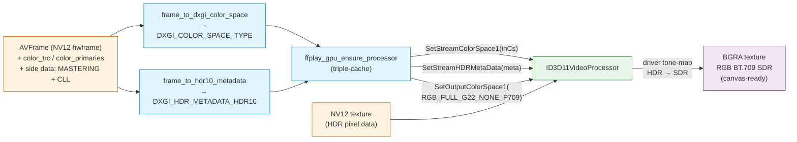
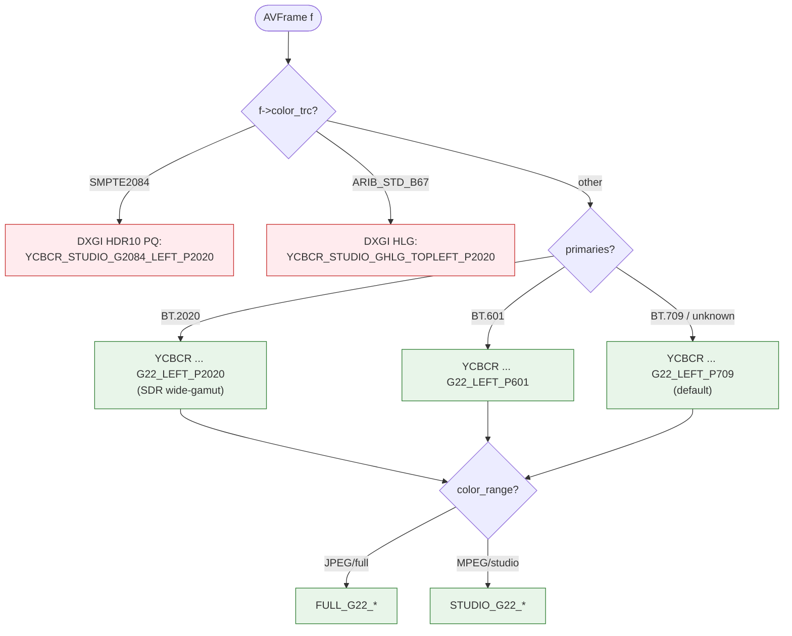
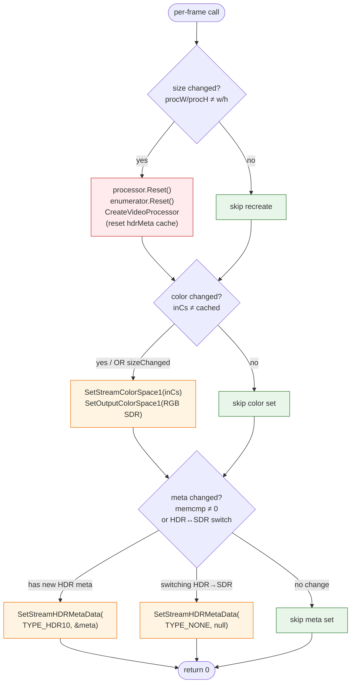
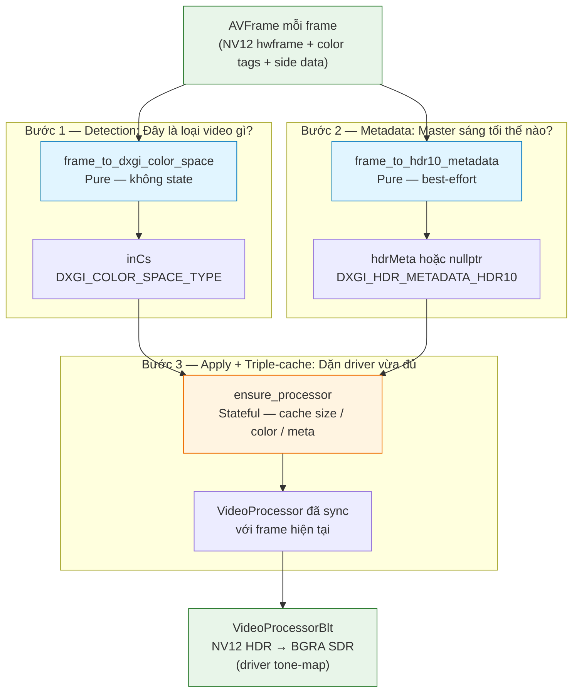
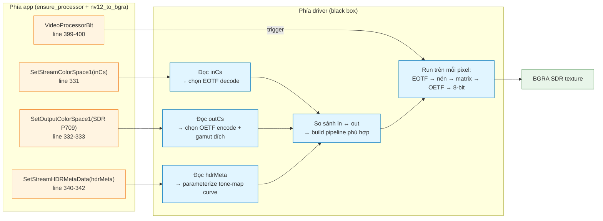

# MagicFFplay — Chiến lược hiển thị HDR

Tài liệu tóm tắt cách `MagicFFplay.cpp` xử lý HDR (HDR10 / HLG) để hiển thị xuống canvas SDR. Tham chiếu: [MagicFFplay.md](./MagicFFplay.md), [MagicFFplay-architecture.md](./MagicFFplay-architecture.md). Code chính nằm trong `frame_to_dxgi_color_space` (`:221`), `frame_to_hdr10_metadata` (`:259`), `ffplay_gpu_ensure_processor` (`:296`).

## 1. Triết lý chung

Player **không tự tone-map**. Toàn bộ HDR → SDR conversion được uỷ thác cho **`ID3D11VideoProcessor` của driver GPU**. Lý do:

- **Driver tối ưu phần cứng** (Intel QSV / NVIDIA / AMD đều có HW tone-mapping path).
- **Per-vendor calibration**: mỗi hãng có algorithm khác nhau (hable, reinhard, BT.2390); driver biết nó hợp với panel/codec hiện tại.
- **Update không cần rebuild app**: driver update là HDR look đẹp lên.

Vai trò của app: **báo đúng** input color space + HDR metadata, **set đúng** output color space, để driver biết "phải tone-map từ X sang Y".

## 2. Pipeline tổng quan



**Đầu vào**: NV12 HDR (10-bit P010 / BT.2020 / PQ hoặc HLG transfer).
**Đầu ra**: BGRA8 SDR (BT.709 full-range gamma 2.2).
**Trung gian**: VideoProcessor được config 3 mặt — input color space, HDR metadata, output color space.

## 3. Detection: AVFrame → DXGI color space

Hàm `frame_to_dxgi_color_space` ưu tiên transfer function trước primaries:



### Tại sao PQ/HLG bị ép studio range?

```cpp
// HDR10 PQ -- DXGI only defines the studio-range variant.
return DXGI_COLOR_SPACE_YCBCR_STUDIO_G2084_LEFT_P2020;
```

DXGI **không expose** full-range PQ/HLG enum. Broadcast/streaming HDR luôn là studio range theo spec (Rec. 2100), nên ép studio là an toàn. Nếu file có `color_range = JPEG` cho HDR — đó là content non-standard, hiếm gặp, ta vẫn xử lý như studio.

### Vì sao priority: transfer trước primaries?

Cùng BT.2020 primaries nhưng:
- Transfer = SMPTE2084 → HDR10 (PQ curve, 10000 nits max)
- Transfer = ARIB_STD_B67 → HLG (relative-luminance, 1000 nits ref)
- Transfer = BT709/SRGB → SDR wide-gamut (rare nhưng có)

Transfer function quyết định **luminance encoding**, là yếu tố sống còn cho tone-mapping. Primaries chỉ là gamut. Driver cần biết transfer **trước** để biết áp dụng EOTF nào trước khi tone-map.

## 4. HDR10 metadata extraction

`frame_to_hdr10_metadata` đọc 2 nhóm side-data từ AVFrame:

### 4.1 Mastering Display Metadata (CIE primaries + luminance)

```
AV_FRAME_DATA_MASTERING_DISPLAY_METADATA
├── display_primaries[3][2]  (R/G/B xy, AVRational)
├── white_point[2]           (xy)
├── min_luminance            (nits)
└── max_luminance            (nits)
```

Đại diện cho "màn hình gốc nội dung được master trên đó" — thông tin để driver scale luminance về panel hiện tại.

**Unit conversion**:
- Primaries: FFmpeg AVRational normalized [0..1] → DXGI fixed-point `× 50000` (UINT16, đơn vị 0.00002).
- Max luminance: nits → nits (DXGI dùng đơn vị 1.0 nit).
- Min luminance: nits → DXGI đơn vị 0.0001 nit (nhân `× 10000`).

### 4.2 Content Light Level (MaxCLL / MaxFALL)

```
AV_FRAME_DATA_CONTENT_LIGHT_LEVEL
├── MaxCLL   (nits, brightest single pixel anywhere in stream)
└── MaxFALL  (nits, brightest frame average)
```

Cho driver biết "đỉnh sáng thực tế trong content" → tone-map có thể chừa headroom thay vì squash dải luminance một cách bảo thủ.

### 4.3 Khi metadata không có

`frame_to_hdr10_metadata` trả `false` nếu **không có MASTERING side data**. Pipeline vẫn chạy: VideoProcessor sẽ tone-map dựa trên transfer function alone (driver dùng default reference values). Quality vẫn ổn nhưng có thể không "đúng" intent của colorist.

## 5. Triple-cache trong `ffplay_gpu_ensure_processor`

Mỗi frame đều có khả năng cần update VideoProcessor state, nhưng làm đầy đủ mọi lần thì tốn. Hàm này cache 3 chiều, mỗi chiều chỉ re-fire khi thực sự đổi:



**Per-frame cost trong steady state** (mọi cache hit): chỉ vài `memcmp` 24 byte. Không alloc, không driver call.

**Khi nào cache miss**:
- **Size**: video resize (rare; segment switch trong DASH/HLS).
- **Color**: stream switch (HDR clip → SDR clip), hoặc content có color shift giữa scene.
- **Metadata**: mastering display info đổi giữa scene (rare; per-scene MaxCLL khả thi).

### Trường hợp đặc biệt: HDR → SDR switch

```cpp
} else if (g->hasHdrMeta) {
    // Clear stale metadata when switching from HDR to SDR.
    SetStreamHDRMetaData(processor, 0, TYPE_NONE, 0, nullptr);
}
```

Nếu trước đó là HDR clip rồi user switch sang SDR clip, **phải gọi `TYPE_NONE`** để driver bỏ HDR metadata cũ. Nếu quên, driver vẫn tưởng đầu vào HDR → tone-map SDR như HDR → ảnh xám/wash-out.

## 6. Output luôn là SDR

```cpp
SetOutputColorSpace1(processor, 0, DXGI_COLOR_SPACE_RGB_FULL_G22_NONE_P709);
```

Output **cố định** `RGB_FULL_G22_NONE_P709` (SDR sRGB-ish, gamma 2.2, BT.709). Lý do:

- **Canvas / Win2D không expose HDR surface** trong pipeline hiện tại. CanvasBitmap nhận BGRA8 SDR; không có Direct3D 11.4 HDR swapchain integration ở phía wrapper.
- **Editor preview thường là SDR**: monitor edit thường calibrate SDR; HDR preview cần phần cứng đặc biệt (HDR1000+ monitor + Windows HDR ON).
- **Đơn giản hoá downstream**: 3 output APIs (`acquire_texture`, `copy_to_texture`, `copy_bgra`) đều nhận BGRA8. Nếu output HDR thì caller phải xử lý 10-bit / float16 → phức tạp.

Trade-off: mất dynamic range. Highlight bị clip / tone-map xuống — không đúng intent HDR. Nếu cần preview HDR thật, phải mở rộng pipeline (output RGB10A2 hoặc R16G16B16A16_FLOAT) và caller hỗ trợ HDR swapchain.

## 7. Yêu cầu phần cứng / OS

| Yêu cầu | Phiên bản | Lý do |
|---|---|---|
| `ID3D11VideoContext2` | Win10 1607+ | `VideoProcessorSetStreamColorSpace1` + `SetStreamHDRMetaData` |
| `D3D11_CREATE_DEVICE_VIDEO_SUPPORT` | mọi GPU hỗ trợ D3D11.1 | tạo VideoProcessor |
| HW decoder D3D11VA | GPU + driver | NV12 hwframe (P010 cho 10-bit HDR) |

Trong `ffplay_shared_gpu_create` (`:162`):
```cpp
if (FAILED(s->videoContext.As(&s->videoContext2)))   { delete s; return nullptr; }
```
Treat as **fatal** — không có VideoContext2 thì HDR không tone-map đúng được, thà fail rõ ràng hơn là render ảnh sai màu im lặng.

## 8. Tổng kết chiến lược

| Chiến lược | Cấp độ | Tóm tắt |
|---|---|---|
| **Driver-side tone-mapping** | Pipeline-wide | Uỷ thác HDR→SDR cho `ID3D11VideoProcessor` thay vì tự shader |
| **Transfer trước primaries** | Detection | Ưu tiên `color_trc` để chọn HDR enum chính xác |
| **Force studio range cho HDR** | Detection | DXGI không có full-range PQ/HLG; broadcast = studio |
| **Side-data extraction (best-effort)** | Metadata | Lấy MASTERING + CLL, không có thì vẫn chạy |
| **Triple-cache** | Per-frame | Size / color / metadata cache độc lập, miss-rate ~0 |
| **HDR→SDR transition clear** | State | `TYPE_NONE` khi switch để không kế thừa metadata cũ |
| **Output fixed RGB BT.709 SDR** | Output | Canvas-friendly; trade off HDR fidelity cho đơn giản |
| **Fatal if no VideoContext2** | Init | Không cho phép silent wrong-color render |
| **Unit conversion chính xác** | Metadata | AVRational → DXGI fixed-point (×50000 / ×10000) |
| **Fallback chain SDR** | Detection | BT.2020 → BT.601 → BT.709 default, studio/full theo color_range |

## 9. Hạn chế hiện tại

- **Không HDR output**: nếu user có monitor HDR1000 và Windows HDR ON, vẫn nhận SDR. Cần thêm output color space option để bỏ tone-map (`outCs = STUDIO_G2084_*`).
- **Không Dolby Vision**: chỉ HDR10/HDR10+ (qua MASTERING) và HLG. Dolby Vision metadata layer chưa parse.
- **Không HDR10+ dynamic metadata**: `AV_FRAME_DATA_DYNAMIC_HDR_PLUS` không được đọc → static tone-map cho toàn stream.
- **Tone-map algorithm phụ thuộc driver**: không deterministic giữa các GPU vendor; QA cross-platform khó.

## 10. Ba bước xử lý — bản đồ cấp cao

Toàn bộ pipeline HDR rút gọn về **đúng 3 bước** mỗi frame, với 3 vai trò rõ ràng: 2 bước đầu là pure function (không state), bước cuối độc quyền giữ state và đồng bộ với driver.



### Vai trò 3 bước trong 1 bảng

| Bước | Câu hỏi trả lời | Tính chất | Nếu sai / thiếu |
|---|---|---|---|
| **1. Detection** | "Đây là HDR10 / HLG / SDR loại nào?" | Pure, chạy lại mỗi frame OK | Sai màu nặng (HDR ↔ SDR nhầm enum) |
| **2. Metadata** | "Master ở dải sáng nào? Đỉnh thực bao nhiêu nits?" | Pure, **best-effort** — không có vẫn chạy | Tone-map kém tối ưu (highlight bị nén bảo thủ) |
| **3. Apply + cache** | "Đã dặn driver chưa? Có cần dặn lại không?" | Stateful, gần miễn phí ở steady state | Tốn CPU vô ích **hoặc** driver giữ state cũ → wash-out |

### Vì sao tách pure vs stateful

- **Bước 1 và 2 là pure function**: input AVFrame → output enum/struct, không đụng driver, không giữ state. Unit-test dễ, gọi lại mỗi frame không tốn gì.
- **Bước 3 độc quyền state**: toàn bộ "đã set gì cho VideoProcessor" tập trung ở `FfplayGpu` struct. Không có code path nào khác lén gọi `SetStreamColorSpace1` / `SetStreamHDRMetaData` → cache luôn phản ánh đúng state thật của driver.

**Ý nghĩa thực tế**: nếu bug "ảnh HDR sai màu" xuất hiện, ta biết đi đâu để debug:
- Sai enum → bước 1 (`frame_to_dxgi_color_space`).
- Tone-map kỳ lạ → bước 2 (`frame_to_hdr10_metadata`), thường là sai unit conversion.
- Sai state khi chuyển clip → bước 3 (`ensure_processor`), thường là cache miss logic hoặc thiếu HDR→SDR clear.

## 11. Driver-side: từ state đến pixel

3 bước ở §10 mô tả **những gì app làm**. Mục này mô tả **những gì xảy ra phía driver** sau khi app set xong state. Quan trọng: app **không xử lý metadata, không tính pixel** — chỉ "gán vào đầu" để driver tự quyết thuật toán.

### 11.1 Driver phân nhánh dựa trên cặp (inCs, outCs)

Cùng line `VideoProcessorBlt` (`MagicFFplay.cpp:399-400`) chạy mỗi frame, nhưng driver build pipeline khác nhau tuỳ cặp input/output color space app khai báo:

| inCs khai báo | outCs (cố định) | Pipeline driver chạy |
|---|---|---|
| `STUDIO_G2084_LEFT_P2020` (HDR10 PQ) | `RGB_FULL_G22_NONE_P709` (SDR) | **Full tone-map**: PQ EOTF → nén luminance (param từ `hdrMeta`) → BT.2020→BT.709 → gamma 2.2 → 8-bit |
| `STUDIO_GHLG_TOPLEFT_P2020` (HLG) | `RGB_FULL_G22_NONE_P709` (SDR) | **HLG tone-map**: HLG OETF⁻¹ → nén → gamut → gamma 2.2 |
| `STUDIO_G22_LEFT_P2020` (SDR wide-gamut) | `RGB_FULL_G22_NONE_P709` (SDR) | Gamut convert BT.2020→BT.709 (không tone-map luminance) |
| `STUDIO_G22_LEFT_P709` (SDR BT.709) | `RGB_FULL_G22_NONE_P709` (SDR) | Chỉ YCbCr→RGB matrix + studio→full range |
| `STUDIO_G22_LEFT_P601` (SDR BT.601) | `RGB_FULL_G22_NONE_P709` (SDR) | BT.601→BT.709 matrix + range stretch |

Driver **so sánh** inCs với outCs:
- Cùng gamut + cùng transfer → chỉ chuyển range / YCbCr→RGB (cheap path).
- Khác gamut → thêm ma trận 3×3 BT.2020→BT.709.
- Khác transfer (HDR vs SDR) → bật tone-map pipeline đầy đủ.

App **không cần biết** driver chọn pipeline nào — chỉ cần khai đúng cặp (inCs, outCs). Cùng codepath `ensure_processor` + `nv12_to_bgra` chạy cho mọi loại input; phân nhánh xảy ra trong driver.

### 11.2 `hdrMeta` parameterize tone-map curve

`hdrMeta` chỉ có ý nghĩa khi tone-map thực sự xảy ra (2 hàng đầu của bảng 11.1). Trong pipeline đó, nó dùng để **chọn điểm uốn của curve nén luminance**:

```
peak_src = hdrMeta.MaxMasteringLuminance   // ví dụ 1000 nits
content  = hdrMeta.MaxCLL                  // ví dụ 800 nits
peak_dst = ~100 nits (SDR)

→ Driver build curve nén [0..peak_src] → [0..peak_dst],
  giữ tuyến tính phần thấp, roll-off phần > content
```

| Trạng thái | Kết quả cho pixel 800 nits |
|---|---|
| **Có metadata** (peak_src = 1000) | → ~95 nits SDR (giữ gần đỉnh, có chi tiết highlight) |
| **Không metadata** (driver assume worst case 10000 nits) | → ~30 nits SDR (bị đè xuống vùng tối, mất chi tiết) |

→ Đó là lý do `frame_to_hdr10_metadata` được mô tả là **best-effort** ở §4: không có metadata không vỡ pipeline, chỉ làm tone-map bảo thủ.

### 11.3 Bản đồ "state app set" ↔ "pipeline driver chạy"



### 11.4 Hệ quả thiết kế

- **App không có shader, không có LUT, không tính một pixel nào** cho tone-map. Toàn bộ phép tính trong driver.
- **Output cố định SDR** (§6) là điều kiện đủ để driver tự kích hoạt tone-map khi input là HDR. Nếu output cũng là HDR, driver có thể bypass tone-map (pass-through).
- **Cùng codepath cho HDR và SDR**: driver phân nhánh nội bộ, không phải app. Code app đơn giản, ít branch, ít test surface.
- **Chất lượng tone-map = chất lượng driver**: cùng file HDR render trên Intel / NVIDIA / AMD có thể khác sắc thái highlight (xem §9). Không có cách "force algorithm" — đó là trade-off cố hữu của chiến lược driver-side.

### 11.5 Trả lời ngắn câu hỏi thường gặp

> "Nếu mình không truyền `hdrMeta` thì output có sai không?"

Không sai về **format** (vẫn ra BGRA SDR đúng), nhưng sai về **intent**: highlight bị nén bảo thủ, ảnh tối hơn ý đồ colorist. Acceptable cho preview, không acceptable cho master/grade.

> "App có cần biết driver chọn pipeline nào không?"

Không. App chỉ cần khai đúng (inCs, outCs, hdrMeta). Driver tự quyết. Đây là điểm hấp dẫn của `ID3D11VideoProcessor` — interface khai báo, không phải imperative.

> "Tại sao không tự viết shader tone-map cho deterministic?"

Trade-off đã chọn ở §1: driver tối ưu HW theo vendor + update không cần rebuild app. Tự shader = mất 2 lợi ích đó để đổi lấy consistency cross-vendor.

## Cross-references

| Chủ đề | File / mục |
|---|---|
| Color space mapping code | `MagicFFplay.cpp:221` (`frame_to_dxgi_color_space`) |
| Metadata extraction code | `MagicFFplay.cpp:259` (`frame_to_hdr10_metadata`) |
| Triple-cache code | `MagicFFplay.cpp:296` (`ffplay_gpu_ensure_processor`) |
| VideoProcessor blit | `MagicFFplay.cpp:357` (`ffplay_gpu_nv12_to_bgra`) |
| GPU layer overview | [MagicFFplay-architecture.md](./MagicFFplay-architecture.md) §1 |
| Render path / display block | [MagicFFplay.md](./MagicFFplay.md) §2.7 |
