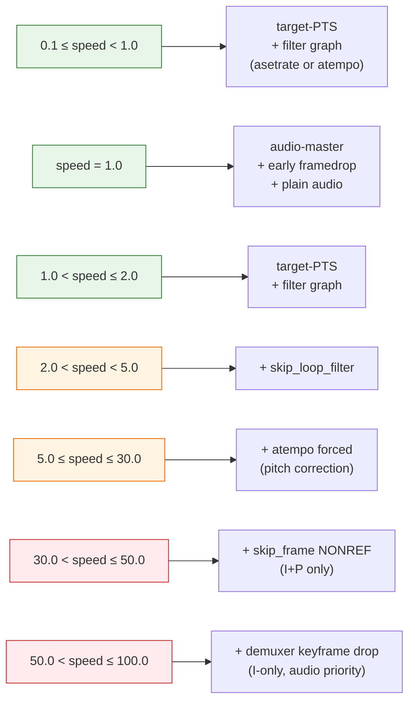

# MagicFFplay — Chiến lược theo speed

Player có **6 ngưỡng speed** kích hoạt các tối ưu khác nhau. Càng cao, càng đánh đổi chất lượng để giữ throughput và lipsync. Tham chiếu chi tiết: [MagicFFplay.md](./MagicFFplay.md), kiến trúc tổng quan: [MagicFFplay-architecture.md](./MagicFFplay-architecture.md).

## Bảng tổng hợp

| Ngưỡng | Layer | Chiến lược | Cơ chế | Tham chiếu |
|---|---|---|---|---|
| `= 1.0` | A/V sync | **Audio-master sync chuẩn ffplay** | `compute_target_delay(vidclk − audclk)` | `video_refresh:1132` |
| `= 1.0` | video_thread | **Early framedrop** | drop nếu `dpts − master_clock < 0` | `get_video_frame:1273` |
| `= 1.0` | audio path | **Bypass filter graph** | `audio_decode_frame` plain copy | `sdl_audio_callback:1621` |
| `≠ 1.0` | A/V sync | **Target-PTS clock** | `target = speed_base_pts + wall × speed`, advance pictq đến frame có `pts ≤ target` | `video_refresh:1094` |
| `≠ 1.0` | audio path | **Filter graph** | `audio_decode_frame_filtered` (atempo hoặc asetrate) | `:1475` |
| `≠ 1.0` | SDL clock | **Scale buffer delay × speed** | `audclk = audio_clock − buffer_delay × speed` | `sdl_audio_callback:1734` |
| `> 2.0` | decoder | **Bỏ deblocking** | `skip_loop_filter = AVDISCARD_ALL` (~30% decode CPU) | `:1255` |
| `≥ 5.0` | audio filter | **Pitch correction forced ON** | atempo bắt buộc, bỏ qua user flag | `audio_filter_init:1394` |
| `> 30.0` | decoder | **Chỉ I+P frame** | `skip_frame = AVDISCARD_NONREF` (~15fps cadence) | `:1257` |
| `> 50.0` | demuxer | **Keyframe-only drop tại demuxer** | `read_thread` `av_packet_unref` mọi packet non-key | `:2107` |

## Giải thích từng nhóm

### Speed = 1.0 — "ffplay mode"

Code chạy gần như ffplay gốc:

- A/V sync **audio-master**: video chạy bám audio clock. Frame quá sớm thì delay, quá trễ thì drop.
- **Early framedrop trong decoder thread**: nếu vừa decode xong mà PTS đã sau master clock → drop ngay, tiết kiệm cả `VideoProcessorBlt`.
- Audio đi đường **plain** (không filter), thấp latency nhất.

### Speed ≠ 1.0 (bất kỳ) — "editor mode"

Chuyển hoàn toàn sang clock kiểu Premiere/CapCut:

- **Target-PTS clock**: `target = base_pts + (now − base_wall) × speed`. Không quan tâm audio clock nữa — vì audio buffer ở speed cao fluctuate liên tục, theo audclk sẽ làm video giật.
- **Tắt early framedrop**: target-PTS đã tự skip frame chuẩn xác trong `video_refresh`. Để cả hai sẽ over-drop, starve pictq.
- **Audio qua filter graph**: cần time-stretch (atempo) hoặc tape-like (asetrate).
- **Anchor SDL clock kèm `× speed`**: 1 byte trong SDL buffer giờ ứng với `× speed` đơn vị thời gian gốc → phải nhân khi tính `buffer_delay`, nếu không lipsync lệch tỉ lệ với speed.
- **Re-anchor** `speed_base_pts/wall_us` sau mỗi seek (`vp->serial` đổi).

### Speed > 2.0 — Bỏ deblocking

H.264/H.265 có loop filter (deblocking) chiếm ~30% decode CPU. Ở speed cao, frame chỉ hiện lướt qua, người xem không thấy artifact deblock → bỏ qua.

```cpp
skip_loop_filter = AVDISCARD_ALL;   // upstream ffmpeg flag
```

### Speed ≥ 5.0 — Pitch correction forced

Dưới 5×, `asetrate` (tape mode) còn vui tai ("hyung-hyung-hyung"). Từ 5× trở lên, pitch shift thành noise inhuman → ép `atempo` (overlap-add giữ pitch) bất kể user flag. Tham chiếu §2.6 của `MagicFFplay.md`:

```cpp
const bool pitch_on = is->pitch_correction || (speed >= 5.0);
```

Chain `atempo` còn bị giới hạn mỗi stage `[0.5, 2.0]`: speed=100 build thành `"atempo=2.0,atempo=2.0,atempo=2.0,atempo=2.0,atempo=2.0,atempo=2.0,atempo=1.5625"` (6 × 2.0 = 64; × 1.5625 = 100).

### Speed > 30.0 — Chỉ giữ I + P frame

B-frame chiếm 40-60% số frame trong stream điển hình nhưng phải decode tham chiếu hai chiều (tốn cache + dependency). Bỏ B → giảm tải decoder ~40%, cadence vẫn liên tục (I + P ≈ 15-30 fps cho stream 60fps).

```cpp
skip_frame = AVDISCARD_NONREF;   // bỏ frame không phải reference
```

### Speed > 50.0 — Keyframe-only tại demuxer

Đây là chiến lược cuối cùng và đánh đổi nhiều nhất.

**Vấn đề**: decoder hw cap ~1500 fps. Ở speed 100× cho video 60fps = 6000 fps yêu cầu — decoder không kịp. Packet dồn vào `videoq`, vượt `MAX_QUEUE_SIZE = 15 MiB`. Nhưng `MAX_QUEUE_SIZE` **chia chung** giữa audioq và videoq → `read_thread` block → audio cũng bị starve. Lipsync chết.

**Giải pháp**: drop **non-keyframe ngay tại demuxer** (trước cả khi vào queue):

```cpp
if (is->playback_speed > 50.0 && !(pkt->flags & AV_PKT_FLAG_KEY)) {
    av_packet_unref(pkt);   // vứt luôn, không decode
}
```

Decoder chỉ thấy IDR keyframe → mỗi frame là một sequence độc lập, không cần reference → throughput ổn định. Cadence rất thưa (mỗi GOP 1 frame, thường 1-2 fps hiển thị) nhưng audio vẫn flow → user thấy seek-bar di chuyển + nghe audio tăng tốc, đủ feedback cho fast-scrub.

## Sơ đồ kích hoạt



## Nguyên tắc thiết kế chung

1. **Threshold tách bằng tầng** — demuxer, decoder, video_refresh, audio_filter mỗi tầng có ngưỡng riêng, không phụ thuộc nhau. Mỗi ngưỡng tắt một lớp cost.
2. **Ưu tiên audio over video** ở speed cao — audio quyết định trải nghiệm scrub. Video chỉ cần "không freeze".
3. **Re-anchor thay vì rebuild** — đổi speed không tái khởi tạo decoder/queue; chỉ snapshot lại `speed_base_pts/wall` + set flag `speed_changed`. Audio filter rebuild lazy ở callback tiếp theo.
4. **Lazy NV12→BGRA** (chung mọi speed nhưng hưởng lợi tỉ lệ với speed): chỉ frame được mark shown mới convert. Speed 100× skip 99 frame ⇒ tiết kiệm 99% `VideoProcessorBlt`.

## Cross-references

| Chủ đề | Mục trong MagicFFplay.md |
|---|---|
| Decoder tuning theo speed | §2.3 |
| Audio filter chain (atempo / asetrate) | §2.6 |
| Video refresh hai nhánh (audio-master vs target-PTS) | §2.7 |
| Đổi speed (non-blocking, re-anchor) | §2.10 |
| Demuxer-level keyframe drop | §2.2 (speed-aware drop) |
